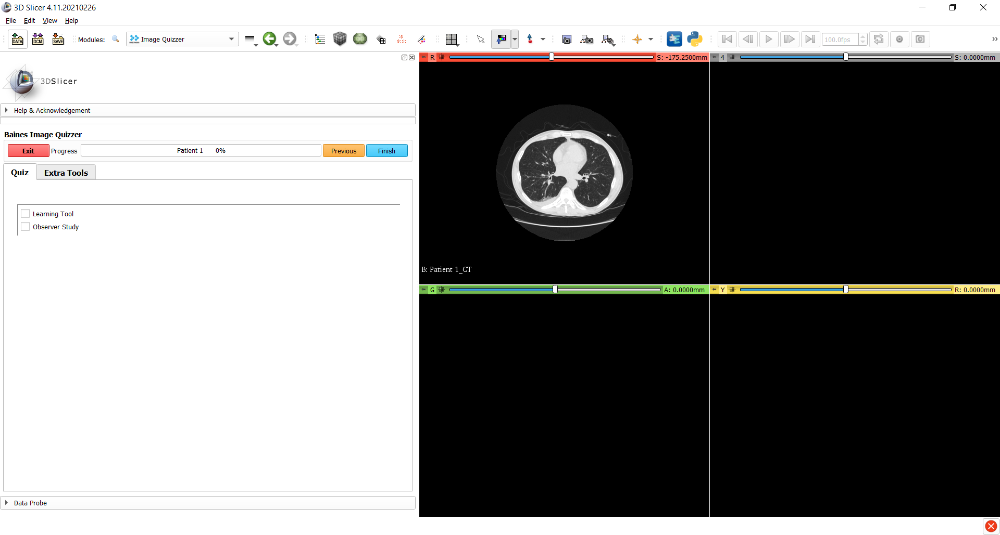
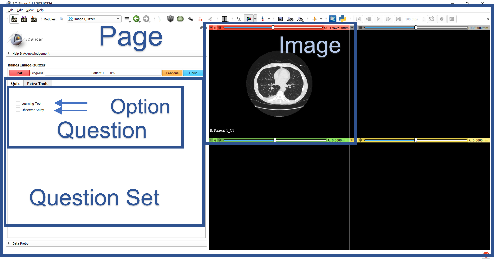

# Build a quiz

The Image Quizzer is controlled by a script that is written using eXtensible Markup Language (XML) formatting. 
This script defines what images and questions are to be displayed and in what order. 
It can be created using a simple editor like Notepad.

!!! tip
    Notepad++ has a plugin for XML tools that can be downloaded to help check syntax as you build your quiz.
    This can be used in conjuction with the *ImageQuizzer.xsd* schema file found in the Resources\XML folder.

## Simple quiz example

Here is a screenshot of a very simple quiz followed by the script that was used to create it.




Script for the Simple Quiz example.

SimpleScript.xml
```
<Session>
	<Page ID="Patient 1">
		<Image ID="CT" Type="Volume">
				<DefaultDestination>Red</DefaultDestination>
				<Layer>Background</Layer>
				<DefaultOrientation>Axial</DefaultOrientation>
				<Path>ImageVolumes\CTChest\CTChest.nrrd</Path>
		</Image>
		<QuestionSet>
			<Question Type="CheckBox">
				<Option>Learning Tool</Option>
				<Option>Observer Study</Option>
			</Question>
		</QuestionSet>
	</Page>
</Session>
```

## Simple quiz elements and layout

Following describes the basic elements of the script and the screen layout.

| Element | Description |
| ------- | ----------- |
| Session | The root of the script containing the entire quiz. |
| Page    | What appears in the 3D Slicer layout. This includes the images on the right side and the quiz on the left side. |
|QuestionSet | An element that containes a group of questions.|
| Question | An element that contains a group of options. |
| Option     | An individual item that forms part of the question. |





## Expanding your quiz

There are many XML elements and attributes available to customize your quiz.
Refer to the [Elements and Attributes](elements_attributes.md) table for details.

!!! tip
    When working on quizzes that have a specific set of questions to be asked for numerous images,
	start the build process using the basic required elements for one Page. 
	Test this in Slicer to make sure it displays what you want.
	Then you can copy/paste the pages, update the Image Path element and the ID & Description attributes.


