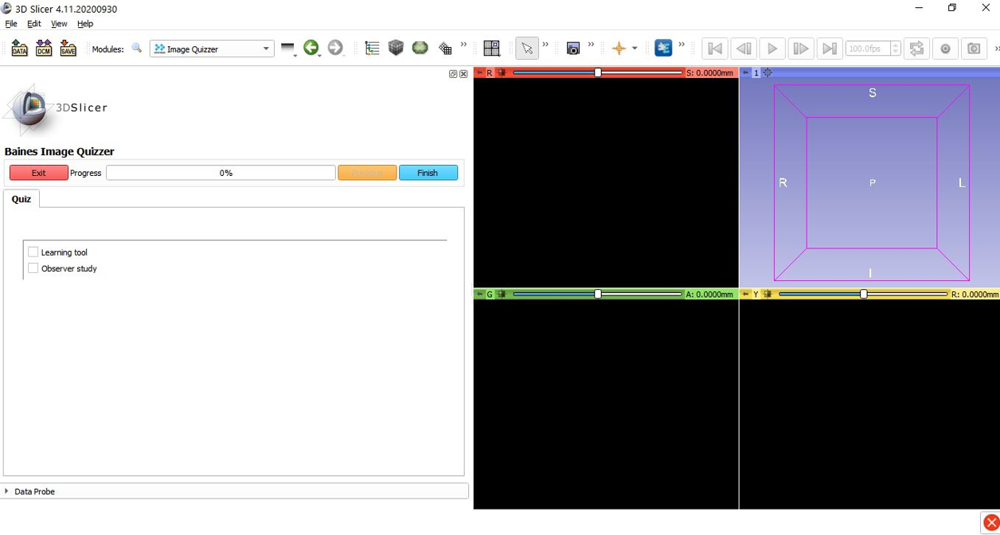

# Build a Quiz

The quiz file defines what images and questions are to be displayed and in what order.
This file uses xml formatting and can be created using a simple editor like Notepad.

Notepad++ has an xml tools plugin that can be downloaded to help with formatting as you build your quiz.

## Simple Example
Here is an example of a very simple quiz to get an idea of the layout.
This example displays questions only - no images.

'''
<Session>
	<Page>
		<QuestionSet>
			<Question Type="CheckBox">
				<Option>Learning Tool</Option>
				<Option>Observer Study</Option>
			</Question>
		</QuestionSet>
	</Page>
</Session>
'''

When run in Image Quizzer, the display will look like this.

General layout of Image Quizzer

Description of Slicer / Quizzer layout.

How does this tie in to the xml file.

