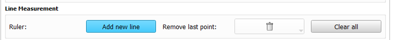

---
hide:
- toc
---
<!-- let javascript handle toc on left sidebar -->
# MinMarkupLinesRequired

## Specs

| ||Details|
|---|---|---|
| **Name** | MinMarkupLinesRequired ||
| **Classification** | attribute ||
| **Parent** | <[Image](index.md)\> ||
| **Required** | no ||
| **Syntax** | MinMarkupLinesRequired="*integer value*" | minimum value = 1 |
| **Dependencies** | [Layer](layer.md) | Not valid on Image elements with Layer="Segmentation" or Layer="Label" |

## Description

This attribute represents the minimum number of markup lines that must be added to the specific image
displayed. The minimum number must be a positive integer (excluding zero).


A markup line is added by selecting **Add new line** button under the **Extra Tools** tab.



The user indicates the start and end points of the line using the left mouse button.
The length of the line in mm is captured and stored in a .mrk.json (readable in Notepad) file in the user's results folder.
See [Line measurement](../../../user/extratools.md#line-measurement) for details.


If you want the user to measure one or more lines that are associated with any image displayed on this page,
use the [MinMarkupLinesRequired](../page/min_markuplines_required_on_any_image.md) attribute for the Page element.

The user will not be allowed to advance to the next page until the required number of lines have been created for this image.


!!! note
    In the case where the same image is repeated in more than one viewing window
	and you need markup lines on the repeated image, you must add the attribute to 
	each of the image elements. See example below.

## Example

This example shows the MR T1 repeated in the Red and Yellow viewing windows and 2 markup
lines are required on the T1 image but no lines are required on the T2 image. The  *MinMarkupLinesRequired*
attribute is repeated for each viewing window.

```
	<Session>
		<Page Descriptor="Brain-MR" ID="Patient1" >
			<Image ID="MR T1" Type="Volume" MinMarkupLinesRequired="2">
				<Layer>Background</Layer>
				<DefaultDestination>Red</DefaultDestination>
				<DefaultOrientation>Axial</DefaultOrientation>
				<Path>ImageVolumes\CT-MR Brain\MRBrainT1.nrrd</Path>
			</Image>
			<Image ID="MR T1" Type="Volume" MinMarkupLinesRequired="2">
				<Layer>Background</Layer>
				<DefaultDestination>Yellow</DefaultDestination>
				<DefaultOrientation>Axial</DefaultOrientation>
				<Path>ImageVolumes\CT-MR Brain\MRBrainT1.nrrd</Path>
			</Image>
			<Image ID="MR T2" Type="Volume">
				<Layer>Background</Layer>
				<DefaultDestination>Green</DefaultDestination>
				<DefaultOrientation>Axial</DefaultOrientation>
				<Path>ImageVolumes\CT-MR Brain\MRBrainT2.nrrd</Path>
			</Image>
		</Page>
	</Session>
```