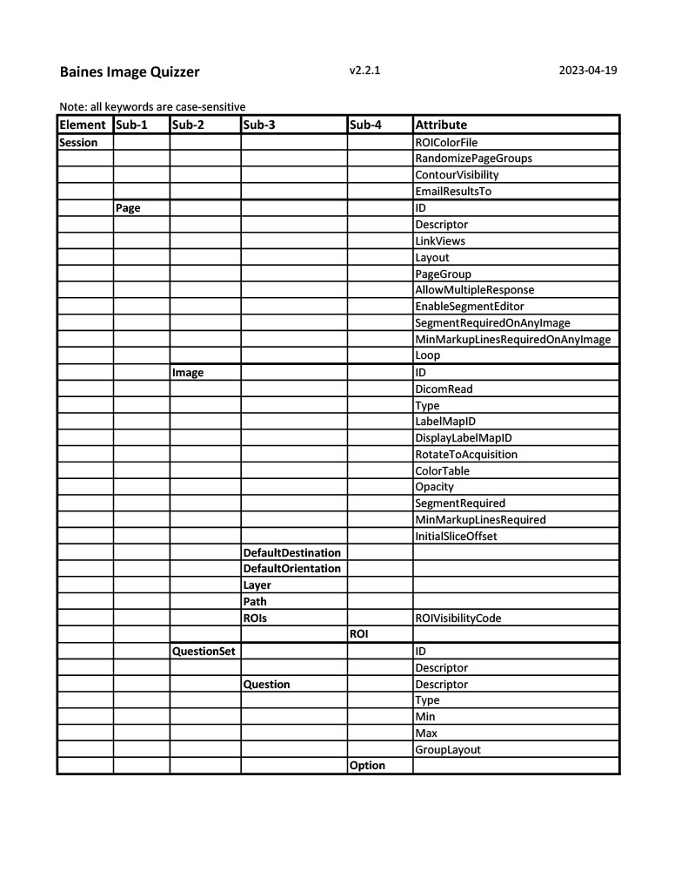

# Elements and attributes

The quiz file is set up with XML elements. Special attributes are associated with 
each element. The combination of elements and attributes enables the administrator to customize
how the Image Quizzer display will display the images and questions and in what order.

The following table provides an overview of the elements, subelements and attributes.
This section provides details for each element and attribute including available options and dependencies.

