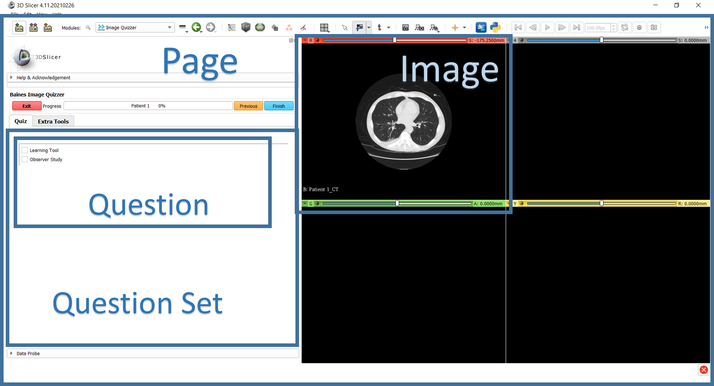

---
hide:
- toc
---
# Page

## Specs

| |Value|Details|
|---|---|---|
| **Name** | Page |  |
| **Classification** | element ||
| **Parent** | <[Session](../session/index.md)\> ||
| **Required** | yes ||
| **Syntax** | <Page\>||

See also: [Image](../image/index.md), [QuestionSet](../questionset/index.md), [Question](../questionset/question/index.md)

## Description
The Page element is a child of the Session element. There can be multiple pages in a quiz session.
Essentially, each Page represents a snap-shot of the screen that the user will see. It defines what Images
and QuestionSets (containing Questions) to display.




Among the many attributes allowed for the Page element, ID and Descriptor are the ones used for identification.
The ID attribute is required but the Descriptor is not. However, during quiz validation, the combination of ID_Descriptor
must be unique throughout all the Page elements.

In some observer studies, each Page represents a different patient.
It could also represent a time point of a Patient's clinical journey (planning, 3 month follow up, 6 month follow up etc.).
Another example could be that there are multiple pages for one patient, each page holding images that represent different cancer sites (e.g. primary and secondary tumours).

## Example

```
<Session>
  <Page ID="Patient 1" Descriptor="CT">
    ...
  </Page>
  <Page ID="Patient 2" Descriptor="CT">
    ...
  </Page>

</Session>
```

## Attributes
#####[ID](id.md)
#####[Descriptor](descriptor.md)
#####[PageGroup](pagegroup.md)
#####[EnableSegmentEditor](enable_segment_editor.md)
#####[SegmentRequiredOnAnyImage](segment_required_on_any_image.md)
#####[Loop](loop.md)
<!--
#####[LinkViews](linkviews.md)
#####[Layout](layout.md)
#####[AllowMultipleResponse](allowmultipleresponse.md)
#####[MinMarkupLinesRequiredOnAnyImage](markuplinesanyimage.md)
-->
