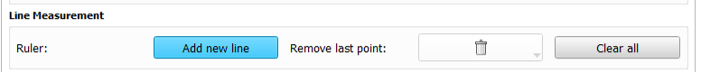

---
hide:
- toc
---
<!-- let javascript handle toc on left sidebar -->
# MinMarkupLinesRequiredOnAnyImage

## Specs

| ||Details|
|---|---|:---:|
| **Name** | MinMarkupLinesRequiredOnAnyImage ||
| **Classification** | attribute ||
| **Parent** | <[Page](index.md)\> ||
| **Required** | no ||
| **Syntax** | MinMarkupLinesRequiredOnAnyImage="*integer value*" | minimum value = 1 |

## Description

This attribute represents the minimum number of markup lines that must be added to any image
displayed on this page. The minimum number must be a positive integer (excluding zero).

A markup line is added by selecting **Add new line** button under the **Extra Tools** tab.

The user indicates the start and end points of the line using the left mouse button.
The length of the line in mm is captured and stored in a .mrk.json (readable in Notepad) file in the user's results folder.
See [Line measurement](../../../user/extratools.md#line-measurement) for details.

If you want the user to measure one or more lines that are associated with a specific image,
use the [MinMarkupLinesRequired](../image/min_markuplines_required.md) attribute for the Image element.