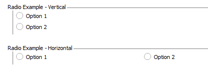
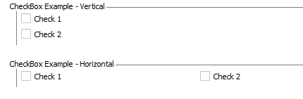
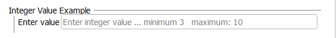
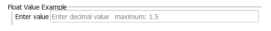
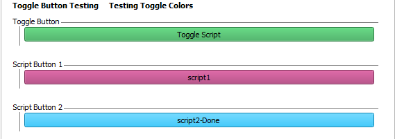
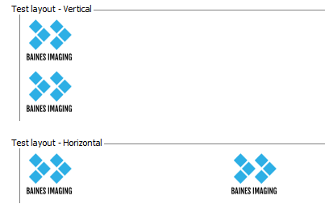
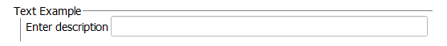
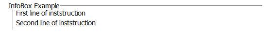

---
hide:
- toc
---
# Type

## Specs

| ||Details|
|---|---|---|
| **Name** | Type ||
| **Classification** | attribute ||
| **Parent** | <[Question](index.md)\> ||
| **Required** | yes ||
| **Syntax** | Type="*option*" |  |
| **Options** |  |* See details below|

## Description

The Type attribute of a Question element specifies how each Option element within 
the Question will be displayed in the quiz. This attribute is mandatory.


## Type Options - Examples and Attributes

| Type |  Associated Attributes |Details|
|---|---|---|
| Radio| [GroupLayout](group_layout.md) | one radio button for each Option element|
| CheckBox | [GroupLayout](group_layout.md) |one checkbox for each Option element|
| IntegerValue| [Min](min.md), [Max](max.md) |box that accepts an integer value|
| FloatValue | [Min](min.md), [Max](max.md) |box that accepts an decimal value |
| Button | [ButtonCustomColorOn](button_custom_color_on.md), [ButtonToggleColorOff](button_toggle_color_off.md) | runs external script defined in the Option element|
| Picture | [GroupLayout](group_layout.md) | to display a picture type file (eg. .png or .jpg)|
| Text ||text box displayed for character intput|
| InfoBox ||text defined in Option element displayed in one line|


### Radio

The radio button group allows the user to toggle between the options listed.
Using the [GroupLayout](group_layout.md) attribute, the options can be displayed
either vertically or horizontally.

___


```
	<Question Type="Radio" Descriptor="RadioButton Example - Vertical" >
		<Option>Option 1</Option> 
		<Option>Option 2</Option>
	</Question>
	<Question Type="Radio" Descriptor="RadioButton Example - Horizontal" GroupLayout="Horizontal">
		<Option>Option 1</Option> 
		<Option>Option 2</Option>
	</Question>

```

### CheckBox

The check box type of question allows the user to select multiple options presented. 
The user can select all or none of the boxes. Using the [GroupLayout](group_layout.md) attribute, the options can be displayed
either vertically or horizontally.

___



```
	<Question Type="CheckBox" Descriptor="CheckBox Example - Vertical">
		<Option>Check 1</Option> 
		<Option>Check 2</Option>
	</Question>
	<Question Type="CheckBox" Descriptor="CheckBox Example - Horizontal" GroupLayout="Horizontal">
		<Option>Check 1</Option> 
		<Option>Check 2</Option>
	</Question>

```


### IntegerValue

The IntegerValue type of question accepts integer values. The [Min](min.md) and/or [Max](max.md) attributes
can restrict the value input to a certain range. 

___



```
	<Question Type="IntegerValue" Descriptor="Integer Value Example " Min="3" Max = "10">
		<Option>Enter value</Option> 
	</Question>

```

### FloatValue

The IntegerValue type of question accepts integer values. The [Min](min.md) and/or [Max](max.md) attributes
can restrict the value input to a certain range. 

___


```
	<Question Type="FloatValue" Descriptor="Float Value Example" Max="1.5">
		<Option>Enter value</Option> 
	</Question>

```


### Button


The Button question type triggers the execution of an external script, allowing customization of the quiz module.
If desired, the script can interact with objects in the Slicer application by importing the 'Slicer' class.

If the script fails to execute, the button will change to a light red color and a warning message appears 
prompting the user to contact the administrator.

The Option element holds the filename of the script located in the .../ImageQuizzer/Inputs/Scripts directory.
The text on the button comes from the name of the script file being run.

Two button modes are available: standard (default) and toggle. 
In the standard mode, the button must be pressed to proceed to the next page. 
Once pressed, the button text is updated with a "-Done" suffix.  

In toggle mode, the user can press the button multiple times or choose not to press it at all.

Attributes associated with a button type of question include: [ButtonCustomColorOn](button_custom_color_on.md) and 
[ButtonToggleColorOff](button_toggle_color_off.md). Setting the ButtonToggleColorOff attribute will activate the 
button's toggle mode. In the example below, it shows that the Script Button 2 has been pressed as it has the '-Done' suffix.

!!! Note "Toggle Buttons"

	When a button is set to 'Toggle' mode, the associated script will execute first.
	The Image Quizzer will finalize by updating the button's color to the value assigned in ButtonToggleColorOff.
___



```
			<Question Type="Button" Descriptor="Toggle Button" ButtonCustomColorOn="50 168 82" ButtonToggleColorOff="0 246 176">
				<Option>Toggle Script.py</Option>
			</Question>
			<Question Type="Button" Descriptor="Script Button 1" ButtonCustomColorOn="168 50 111">
				<Option>script1.py</Option>
			</Question>
			<Question Type="Button" Descriptor="Script Button 2">
				<Option>script2.py</Option>
			</Question>

```


### Picture

The Picture question type enables the display of an image file (such as .png or .jpg) in the quiz.
This can be useful (for example) to display a legend or a picture of a set of instructions. 

Using the [GroupLayout](group_layout.md) attribute, the options can be displayed
either vertically or horizontally.

The Option element holds the filename for the picture file located in the .../ImageQuizzer/Inputs/MasterQuiz directory
along with the XML master quiz file.

___


```
	<Question Type="Picture" Descriptor="Test layout - Vertical" GroupLayout="Vertical">
		<Option>BainesLogoSmall.png</Option>
		<Option>BainesLogoSmall.png</Option>
	</Question>
	<Question Type="Picture" Descriptor="Test layout - Horizontal" GroupLayout="Horizontal">
		<Option>BainesLogoSmall.png</Option>
		<Option>BainesLogoSmall.png</Option>
	</Question>

```

### Text

The Text type of question will accept character input from the user.

___


```
	<Question Type="Text" Descriptor="Text Example">
		<Option>Enter description</Option> 
	</Question>

```

### InfoBox

The InfoBox type of question is used to display lines of text.

___


```
	<Question Type="InfoBox" Descriptor="InfoBox Example">
		<Option>First line of inststruction</Option> 
		<Option>Second line of inststruction</Option>
	</Question>

```


## Example

See also [Question type](../../../examples/example_question_type.md) examples.

