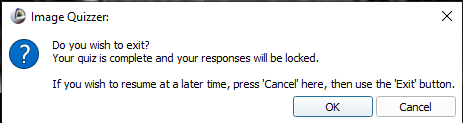
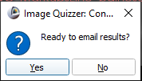

# Email results

## Specs

| ||
|---|---|
| **Name** | EmailResultsTo |
| **Classification** | attribute |
| **Parent** | <[Session](index.md)\> |
| **Required** | no |
| **Syntax** | EmailResultsTo="*youremailaddress@example.com*" |

## Description
A feature of the Image Quizzer is to have a user's results folder emailed to the administrator upon completion of the quiz.
Upon completion of the quiz, the user will be prompted to initiate the email process.

The user has the option to delay the email process if he/she wants to review the quiz.
If the user logs back in to review the quiz after quiz completion, the Image Quizzer will automatically
prompt the user to initiate the email process. This is described in further detail
in the section [Zip results file](#zip-results-file).


## Setup

In order to activate this feature, there are 2 steps required.


* Create the file 'smtp_config.txt' in the Resources/Config directory:
* The administrator must add the 'EmailResultsTo' attribute to the Session element in the quiz xml file. 

### smtp_config
    Currently in this directory, you will find smtp_config_template.txt.

```
.../
   └─ImageQuizzer/
     └─Resources/
       └─Config/
         └─smtp_config_template.txt
```

Copy this file and rename it smtp_config.txt to be edited with your 
host email server details.
	
```
.../
   └─ImageQuizzer/
     └─Resources/
       └─Config/
         └─smtp_config_template.txt
         └─smtp_config.txt
```

Following is the smtp_config.txt format:
	
```
[smtp]
host=your_host_server
username=address_of_your_host_email_account@example.com
password=app_password_of_your_host_email_account
port=your_host_server_port_here
```

### attribute assignment

```
<Session EmailResultsTo="youremailaddress@example.com">
    ...
</Session>
```
## Zip results file

With config file and attribute setup complete, the email process will begin once
the user has completed the quiz and has pressed the *Finish* button.
First, the user will see a pop-up window to confirm that the user wants to exit the quiz.




Pressing the OK button to exit will mark the quiz as complete and all responses are locked.
Then the user is then prompted to email the results.



If 'Yes' is pressed, the module will zip up the user's quiz results folder (quizname.zip)
and place it in the same folder where the quiz results are located. The zip
file includes the results XML file as well as any *Page* folders containing 
contour and markup files if any exist.

```
.
└─ImageDatabase/
   ├─SlicerDicomDatabse/
   └─Users/
     ├─Observer1/
     │ └─ObserverContouringStudy.zip
     │ └─ObserverContouringStudy.xml
	 ├─Page1/
	 ├─Page2/
	 │...
```

This zip file will be attached to the email contents and sent to the email address assigned to the
'EmailResultsTo' attribute.

If the user presses 'No' to the email prompt, the user can still reopen the quiz
to email the results at a later time. When restarting the Image Quizzer to review
a completed quiz, the following prompt will appsear:


If 'Yes' is pressed, the user can review the images but recorded responses can not
be modified. During the review the user can either press Exit to start the exit/email processes or
press Next until the last Page and QuestionSet is reached to start the exit/email stage.

If 'No' is pressed, the module will take you directly to the exit and email stage.
