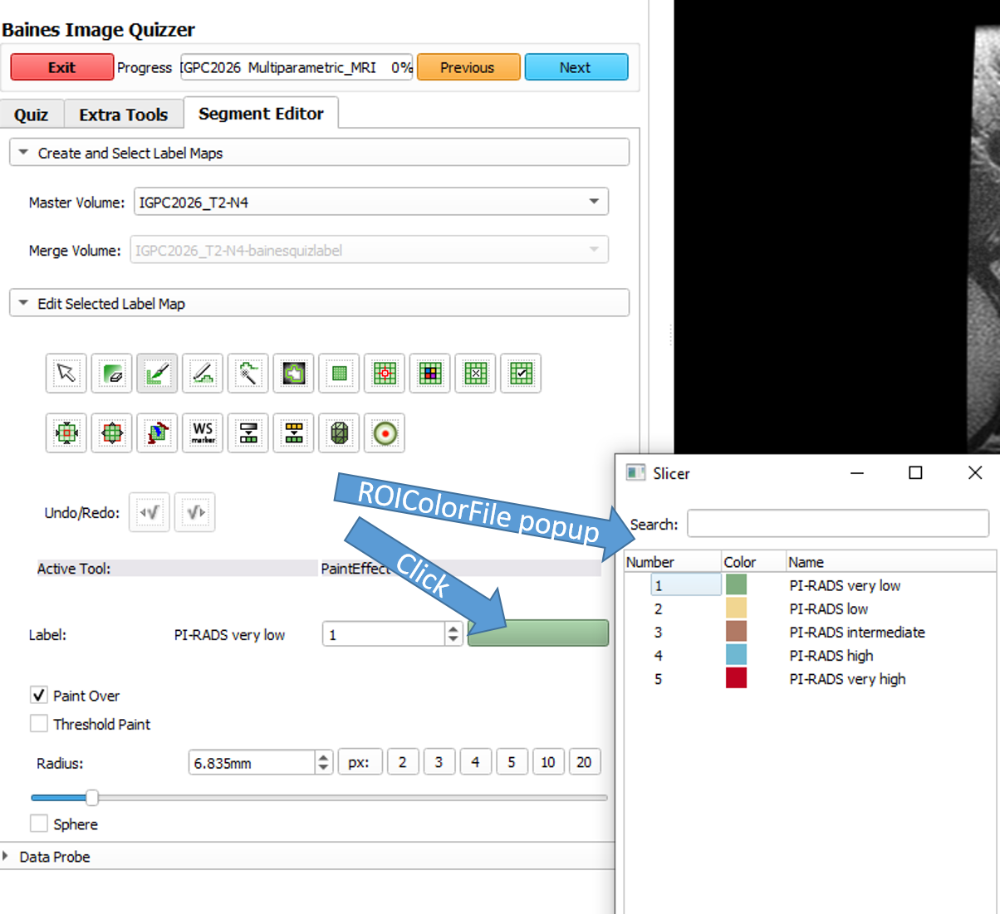

---
hide:
- toc
---
<!-- let javascript handle toc on left sidebar -->
# ROIColorFile

## Specs

| ||Details|
|---|---|:---:|
| **Name** | ROIColorFile ||
| **Classification** | attribute ||
| **Parent** | <[Session](index.md)\> ||
| **Required** | no ||
| **Syntax** | ROIColorFile="*colorfilename*" | filename without .txt extension |

## Description

The ROIColorFile attribute gives the administrator the ability to assign specific ROI names and colors that will appear as options
when the user is contouring in the segment editor. This can be useful when you want to restrict the user to
a specific set of ROI's and have each ROI categorized by color.

## Setup

To activate this feature, the administrator must create a .txt file in an editor using the syntax shown below.
This file must be saved in the same folder as the study xml file.


## Syntax

Syntax for each line in the text file (The roi# cannot be 0) :

```
roi# roi_name red green blue alpha
```

## Example

### Setup

A color file is assigned to a study for PI-Rads segmentation.
The administrator creates a text file (PiRadsStudy_colors.txt) and places it in
the same directory as the XML for this quiz (PIRADS_SegmentationStudy.xml).

!!! tip
    In this example, these files are being placed in the default directory used by 
    Image Quizzer for the master quiz. This saves the user from having to browse to a 
	different directory.

```
.

└─ImageQuizzer/
  └─Resources/
    └─XML/
      ├─PIRADS_SegmentationStudy.xml
      └─PiRadsStudy_colors.txt
		
```

Add the attribute to the <Session\> element.	
```
<Session ROIColorFile="PiRadsStudy_colors">
	<Page>
		...
	</Page>
</Session>
```

Create the color text file.
```
PiRadsStudy_colors.txt

1 PI-RADS_very_low 128 174 128 255
2 PI-RADS_low 241 214 145 255
3 PI-RADS_intermediate 177 122 101 255
4 PI-RADS_high 111 184 210 255
5 PI-RADS_very_high 191 2 34 255

```

###Usage

To activate the color file popup in the Segment Editor, the user must press on the label's color bar.



