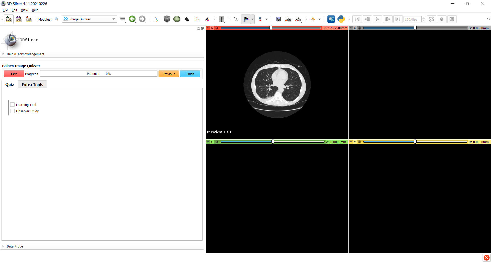

---
hide:
- toc
---
<!-- let javascript handle toc on left sidebar -->
# Building basics


## Prep

Download and save Slicer's CTChest [sample data](../../getting_started/index.md#sample-datasets).

## Simple quiz example

Here is a screenshot of a very simple quiz followed by the script that was used to create it.




Script for the Simple Quiz example.

SimpleScript.xml
```
<Session>
	<Page ID="Patient 1">
		<Image ID="CT" Type="Volume">
				<DefaultDestination>Red</DefaultDestination>
				<Layer>Background</Layer>
				<DefaultOrientation>Axial</DefaultOrientation>
				<Path>ImageVolumes\CTChest\CTChest.nrrd</Path>
		</Image>
		<QuestionSet>
			<Question Type="CheckBox">
				<Option>Learning Tool</Option>
				<Option>Observer Study</Option>
			</Question>
		</QuestionSet>
	</Page>
</Session>
```


## Script elements layout


## Expanding your quiz

There are many XML elements and attributes available to customize your quiz.
Some of these are shown in the Quiz examples section. You can also
refer to the [Scripting references](../elements_attributes/index.md) section for more details.

!!! tip
    When working on quizzes that have a specific set of questions to be asked for numerous sets of images,
	start the build process using the basic required elements for one page. 
	Test this in Slicer to make sure it displays what you want.
	Then you can copy/paste the pages, update the image Path element and the ID & 
	Description attributes to make each page unique.

## Testing your quiz

When you are building your quiz, the general pattern is:

1. create the XML quiz file (aka __master__ quiz)
1. run ImageQuizzer 
1. make additional modifications to master quiz
1. **remove quiz folder under the Users folder**
1. rerun ImageQuizzer on modified master

!!! Note
    In step 1, the Image Quizzer creates a copy of the master quiz in the user folder (the results quiz) to capture responses.
	If you don't remove this results quiz folder (step 4), Image Quizzer will
	assume the user is resuming the quiz that was already started. It reads the copied
	quiz and the new modifications made to the master quiz will not be reflected.