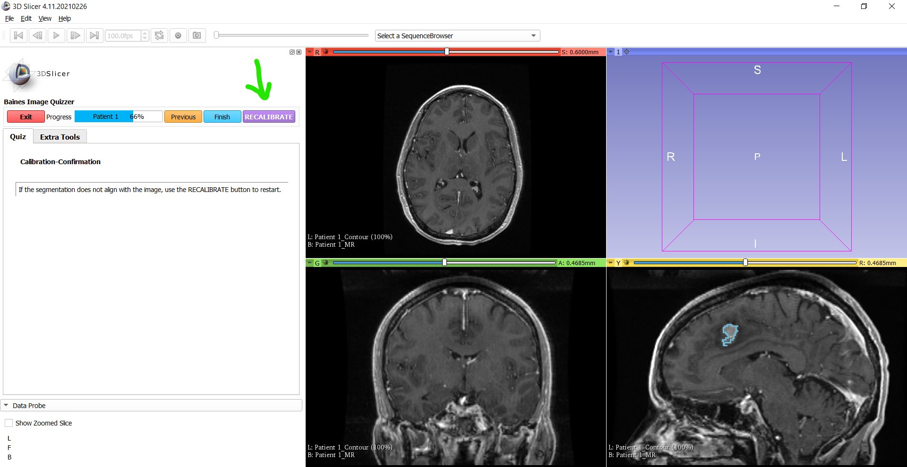

---
hide:
- toc
---
<!-- let javascript handle toc on left sidebar -->
# Bookmarks

The administrator can establish a bookmarked page and a button on a following page 
that permits the user to restart the quiz from the bookmarked page.


## Prep

Download and save Slicer's [RECIST dataset](sample_data.md#tutorial-data-links) as described in the [sample data suggested tree structure](sample_data.md#suggested-tree-structure) section.

Suggested folder structure to match script:

```
.
└─ ImageDatabase/
    └─ ImageVolumes/
        └─ RECIST-Tutorial-Data/
            ├─ 1007-spgr.nrrd
			└─ 1007-spgr.label.nrrd   
```

## Script example


```
<Session>
    <Page ID="Patient 1" Layout="OneUpRedSlice" BookmarkID="Calibrate" AllowMultipleResponse="Y">
        <Image ID="Calibration" Type="Volume">
                <DefaultDestination>Red</DefaultDestination>
                <Layer>Background</Layer>
                <DefaultOrientation>Axial</DefaultOrientation>
                <Path>ImageVolumes\RECIST-Tutorial-Data\2007-spgr.nrrd</Path>
        </Image>
        <QuestionSet Descriptor="Calibration">
            <Question Type="InfoBox">
                <Option>Click on markers in the viewing window to calibrate the device.</Option>
                <Option></Option>
                <Option></Option>
                <Option>Note: (This is a simulation (use your imagination) - there are no markers at the corners.)</Option>
            </Question>
        </QuestionSet>
    </Page>
	<Page ID="Filler page">
        <QuestionSet Descriptor="Instructional page">
            <Question Type="InfoBox">
                <Option>This is a filler page - set here to demonstrate bookmark functionality.</Option>
				<Option></Option>
				<Option>Administrator can create a number of pages between the BookmarkID and the GoToBookmark pages.</Option>
            </Question>
        </QuestionSet>
	</Page>
    <Page ID="Patient 1" GoToBookmark="Calibrate RECALIBRATE" >
        <Image ID="MR" Type="Volume">
                <DefaultDestination>Red</DefaultDestination>
                <Layer>Background</Layer>
                <DefaultOrientation>Axial</DefaultOrientation>
                <Path>ImageVolumes\RECIST-Tutorial-Data\2007-spgr.nrrd</Path>
        </Image>
        <Image ID="MR" Type="Volume">
                <DefaultDestination>Green</DefaultDestination>
                <Layer>Background</Layer>
                <DefaultOrientation>Coronal</DefaultOrientation>
                <Path>ImageVolumes\RECIST-Tutorial-Data\2007-spgr.nrrd</Path>
        </Image>
        <Image ID="MR" Type="Volume">
                <DefaultDestination>Yellow</DefaultDestination>
                <Layer>Background</Layer>
                <DefaultOrientation>Sagittal</DefaultOrientation>
                <Path>ImageVolumes\RECIST-Tutorial-Data\2007-spgr.nrrd</Path>
        </Image>
        <Image ID="Contour" Type="LabelMap">
                <DefaultDestination>Red</DefaultDestination>
                <Layer>Label</Layer>
                <DefaultOrientation>Axial</DefaultOrientation>
                <Path>ImageVolumes\RECIST-Tutorial-Data\2007-spgr.label.nrrd</Path>
        </Image>
        <Image ID="Contour" Type="LabelMap">
                <DefaultDestination>Green</DefaultDestination>
                <Layer>Label</Layer>
                <DefaultOrientation>Coronal</DefaultOrientation>
                <Path>ImageVolumes\RECIST-Tutorial-Data\2007-spgr.label.nrrd</Path>
        </Image>
        <Image ID="Contour" Type="LabelMap">
                <DefaultDestination>Yellow</DefaultDestination>
                <Layer>Label</Layer>
                <DefaultOrientation>Sagittal</DefaultOrientation>
                <Path>ImageVolumes\RECIST-Tutorial-Data\2007-spgr.label.nrrd</Path>
        </Image>
        <QuestionSet Descriptor="Calibration-Confirmation">
            <Question Type="InfoBox">
                <Option>If the segmentation does not align with the image, use the RECALIBRATE button to restart.</Option>
            </Question>
        </QuestionSet>
    </Page>
</Session>

```

## Display results

```
>>>>>>>>>>>>>>>>>>>>>>>>>>>>>>>>>>>>>>>>>>>>>>>>>>>>>>>>>>>>>>>>>>>>>>>
```



```
>>>>>>>>>>>>>>>>>>>>>>>>>>>>>>>>>>>>>>>>>>>>>>>>>>>>>>>>>>>>>>>>>>>>>>>
```
