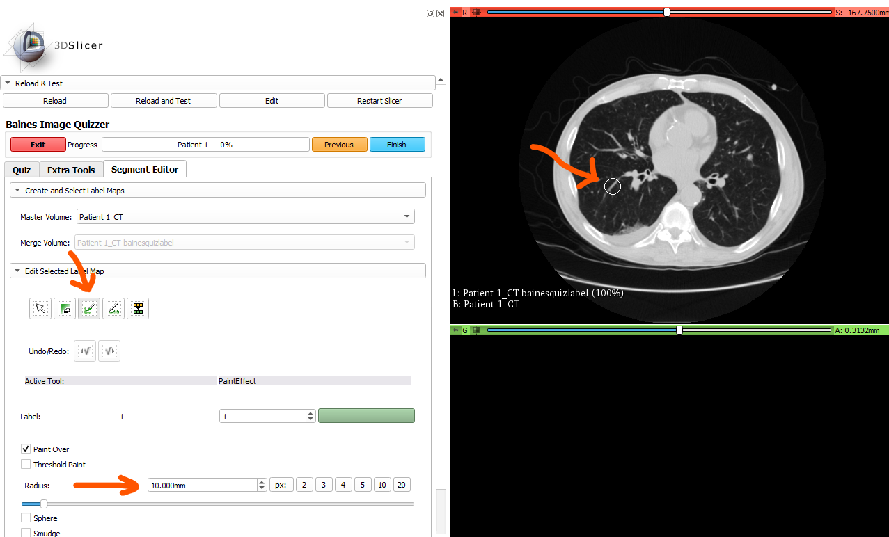

---
hide:
- toc
---
<!-- let javascript handle toc on left sidebar -->
# Contour tool radius

The administrator has the ability to customize the initial radius setting (mm) of the paint tool for image annotation.
This setting applies to all images loaded on the page.

By customizing the radius specifically for the uploaded images and the current task, users can promptly start 
contouring without the need to modify the radius setting.


There are also keyboard shortcuts to fine tune the radius.

| Shortcuts | Key | Effect |
|-----------|-----|--------|
| Paint/Erase      | + = | increase brush radius by 20% |
|       | _ - | decrease brush radius by 20% |


## Prep

Download and save Slicer's CTChest dataset as described in the [sample data suggested tree structure](sample_data.md#suggested-tree-structure) section.

```
.
└─ ImageDatabase/
    └─ ImageVolumes/
        └─ CTChest/
            └─ CTChest.nrrd
			   
```

## Script example

```
<Session>
    <Page ID="Patient 1" ContourToolRadius="10" EnableSegmentEditor="Y">
        <Image ID="CT" Type="Volume">
                <DefaultDestination>Red</DefaultDestination>
                <Layer>Background</Layer>
                <DefaultOrientation>Axial</DefaultOrientation>
                <Path>ImageVolumes\CTChest\CTChest.nrrd</Path>
        </Image>
        <QuestionSet>
            <Question Type="CheckBox">
                <Option>Learning Tool</Option>
                <Option>Observer Study</Option>
            </Question>
        </QuestionSet>
    </Page>
</Session>
```

## Display results

```
>>>>>>>>>>>>>>>>>>>>>>>>>>>>>>>>>>>>>>>>>>>>>>>>>>>>>>>>>>>>>>>>>>>>>>>
```



```
>>>>>>>>>>>>>>>>>>>>>>>>>>>>>>>>>>>>>>>>>>>>>>>>>>>>>>>>>>>>>>>>>>>>>>>
```
