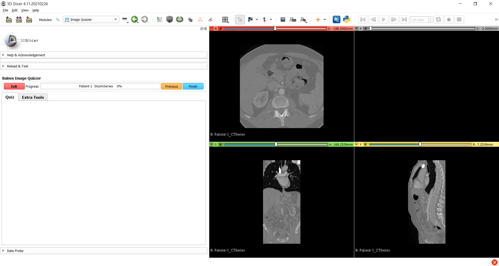

---
hide:
- toc
---
<!-- let javascript handle toc on left sidebar -->
# Loading DICOM images

The Image Quizzer can load DICOM images although this can be slow depending on the number of .dcm files to be read in.

!!! tip
    If these images can be converted to a data volume (e.g. .nii or .nrrd), the load will be much faster.


The main attributes of interest used for this example include:

- DicomRead="*option*"
    - an attribute of the Image element
	- if set to "Y", images will be loaded using dicom functionality
	- if set to "N" (default) images are loaded as data volumes
	
- Path
    - an element that is a child of the Image element
    - directory path to one dicom slice for the image
	


## Prep

Download the DICOM test data as described in the [sample data sets](index.md#sample-data) section.


From the downloaded tutorial data, extract the dataset1_TorsoCT folder to a subfolder under ImageVolumes/ as shown.

```
.
└─ ImageQuizzerData/
      └─ ImageVolumes/
          └─ dataset1_TorsoCT/
                ├─ IM-0001-0001.dcm
                ├─ IM-0001-0002.dcm
                ├─ IM-0001-0003.dcm
				├─ ...
                ├─ IM-0001-0290.dcm
                └─ IM-0001-0291.dcm
```

## Script example

```
<Session>
	<Page ID="Patient-1" Descriptor="DicomSeries">
		<Image DicomRead="Y" Type="Volume" ID="CTSeries">
			<DefaultDestination>Red</DefaultDestination>
			<Layer>Background</Layer>
			<DefaultOrientation>Axial</DefaultOrientation>
			<Path>ImageVolumes\dataset1_TorsoCT\IM-0001-0001.dcm</Path>
		</Image>
		<Image DicomRead="Y" Type="Volume" ID="CTSeries">
			<DefaultDestination>Yellow</DefaultDestination>
			<Layer>Background</Layer>
			<DefaultOrientation>Sagittal</DefaultOrientation>
			<Path>ImageVolumes\dataset1_TorsoCT\IM-0001-0001.dcm</Path>
		</Image>
		<Image DicomRead="Y" Type="Volume" ID="CTSeries">
			<DefaultDestination>Green</DefaultDestination>
			<Layer>Background</Layer>
			<DefaultOrientation>Coronal</DefaultOrientation>
			<Path>ImageVolumes\dataset1_TorsoCT\IM-0001-0001.dcm</Path>
		</Image>
	</Page>
</Session>
```

## Display results

```
>>>>>>>>>>>>>>>>>>>>>>>>>>>>>>>>>>>>>>>>>>>>>>>>>>>>>>>>>>>>>>>>>>>>>>>
```
(Note - there were no questions scripted for this example. Only images are displayed.)


