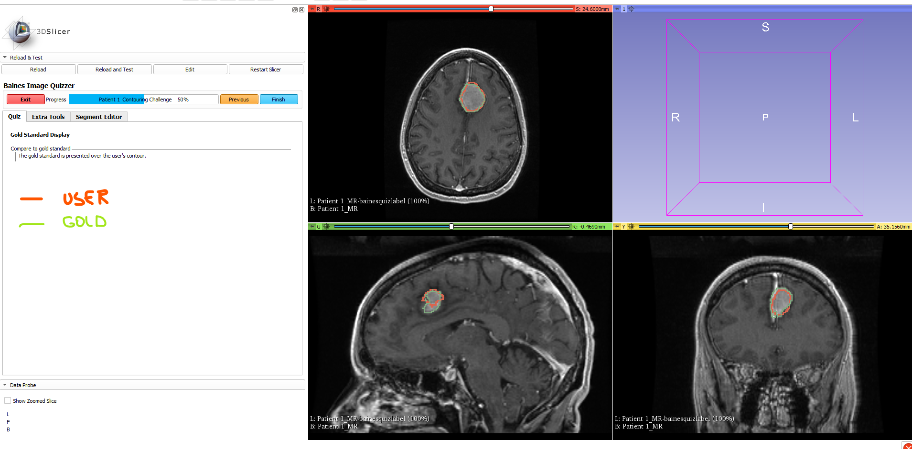

---
hide:
- toc
---
<!-- let javascript handle toc on left sidebar -->

# Gold standard - Learning tool

An application for the Image Quizzer is to use it as a educational tool. You can have a user contour
a lesion on one page and on the following page, display the user's contour along with a pre-defined gold
standard.

In the script example below,
in order to display both the user's contour and the gold standard together, the gold standard is loaded in
as an Image Type = "*Segmentation*" on the *Segmentation* layer. The user's contour is redisplayed on the *Label* layer.


## Prep


Download and save Slicer's [RECIST dataset](sample_data.md#tutorial-data-links) as described in the [sample data suggested tree structure](sample_data.md#suggested-tree-structure) section.

Suggested folder structure to match script:

```
.
└─ ImageDatabase/
    └─ ImageVolumes/
        └─ RECIST-Tutorial-Data/
            ├─ 1007-spgr.nrrd
			└─ 1007-spgr.label.nrrd   
```


## Script example


```
<Session>
    <Page ID="Patient 1" Descriptor="Contouring Challenge" EnableSegmentEditor="Y" SegmentRequiredOnAnyImage="Y">
        <Image Type="Volume" ID="MR" RotateToAcquisition="Y" LabelMapID="MR_Contour" InitialSliceOffset="25">
            <DefaultDestination>Red</DefaultDestination>
            <Layer>Background</Layer>
            <DefaultOrientation>Axial</DefaultOrientation>
            <Path>ImageVolumes\RECIST-Tutorial-Data\2007-spgr.nrrd</Path>
        </Image>
        <Image Type="Volume" ID="MR" RotateToAcquisition="Y" InitialSliceOffset="0.468">
            <DefaultDestination>Green</DefaultDestination>
            <Layer>Background</Layer>
            <DefaultOrientation>Sagittal</DefaultOrientation>
            <Path>ImageVolumes\RECIST-Tutorial-Data\2007-spgr.nrrd</Path>
        </Image>
        <Image Type="Volume" ID="MR" RotateToAcquisition="Y" InitialSliceOffset="35.15">
            <DefaultDestination>Yellow</DefaultDestination>
            <Layer>Background</Layer>
            <DefaultOrientation>Coronal</DefaultOrientation>
            <Path>ImageVolumes\RECIST-Tutorial-Data\2007-spgr.nrrd</Path>
        </Image>
        <QuestionSet ID="Contouring Challenge" Descriptor="">
            <Question Type="InfoBox" Descriptor="Segmentation Instructions">
                <Option>Contour the tumor using the segment editor.</Option>
            </Question>
        </QuestionSet>
    </Page>
    <Page ID="Patient 1" Descriptor="Contouring Challenge"  EnableSegmentEditor="Y">
        <Image Type="Volume" ID="MR" RotateToAcquisition="Y" DisplayLabelMapID="MR_Contour">
            <DefaultDestination>Red</DefaultDestination>
            <Layer>Background</Layer>
            <DefaultOrientation>Axial</DefaultOrientation>
            <Path>ImageVolumes\RECIST-Tutorial-Data\2007-spgr.nrrd</Path>
        </Image>
        <Image Type="Volume" ID="MR" RotateToAcquisition="Y" DisplayLabelMapID="MR_Contour">
            <DefaultDestination>Green</DefaultDestination>
            <Layer>Background</Layer>
            <DefaultOrientation>Sagittal</DefaultOrientation>
            <Path>ImageVolumes\RECIST-Tutorial-Data\2007-spgr.nrrd</Path>
        </Image>
        <Image Type="Volume" ID="MR" RotateToAcquisition="Y" DisplayLabelMapID="MR_Contour">
            <DefaultDestination>Yellow</DefaultDestination>
            <Layer>Background</Layer>
            <DefaultOrientation>Coronal</DefaultOrientation>
            <Path>ImageVolumes\RECIST-Tutorial-Data\2007-spgr.nrrd</Path>
        </Image>
        <Image Type="Segmentation" ID="Gold" RotateToAcquisition="Y">
            <DefaultDestination>Red</DefaultDestination>
            <Layer>Segmentation</Layer>
            <Path>ImageVolumes\RECIST-Tutorial-Data\2007-spgr.label.nrrd</Path>
            <ROIs ROIVisibilityCode='All'></ROIs>
        </Image>
        <Image Type="Segmentation" ID="Gold" RotateToAcquisition="Y">
            <DefaultDestination>Green</DefaultDestination>
            <Layer>Segmentation</Layer>
            <Path>ImageVolumes\RECIST-Tutorial-Data\2007-spgr.label.nrrd</Path>
            <ROIs ROIVisibilityCode='All'></ROIs>
        </Image>
        <Image Type="Segmentation" ID="Gold" RotateToAcquisition="Y">
            <DefaultDestination>Yellow</DefaultDestination>
            <Layer>Segmentation</Layer>
            <Path>ImageVolumes\RECIST-Tutorial-Data\2007-spgr.label.nrrd</Path>
            <ROIs ROIVisibilityCode='All'></ROIs>
        </Image>
        <QuestionSet ID="Gold Standard Display" Descriptor="">
            <Question Type="InfoBox" Descriptor="Compare to gold standard">
                <Option>The gold standard is presented over the user's contour.</Option>
            </Question>
        </QuestionSet>
    </Page>
</Session>
```

## Screen shot

```
>>>>>>>>>>>>>>>>>>>>>>>>>>>>>>>>>>>>>>>>>>>>>>>>>>>>>>>>>>>>>>>>>>>>>>>
```



```
>>>>>>>>>>>>>>>>>>>>>>>>>>>>>>>>>>>>>>>>>>>>>>>>>>>>>>>>>>>>>>>>>>>>>>>
```

