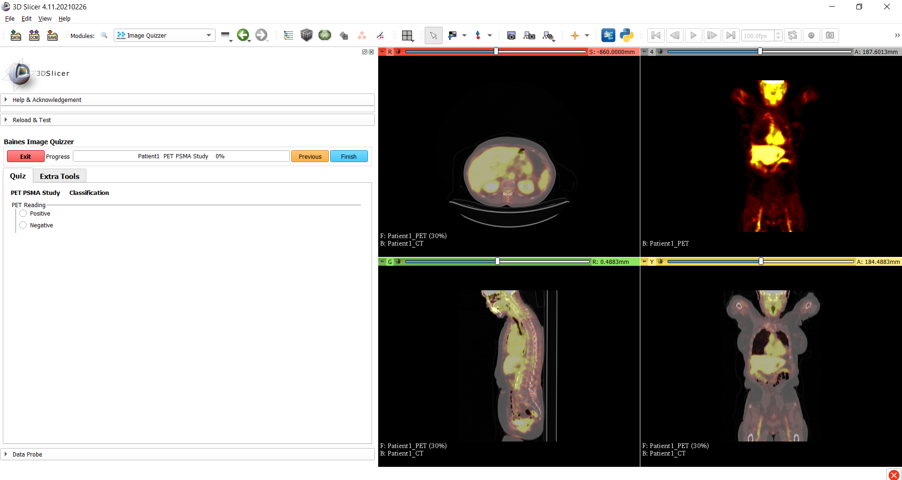

---
hide:
- toc
---
<!-- let javascript handle toc on left sidebar -->
# Layering images

The Image Quizzer enables you to layer two images in one viewing window.
This example touches on a number of topics:

- layering images in background and foreground
- adjusting opacity of foreground image
    - if this attribute is not defined, the opacity will default to .5
- assign a color table to an image to change the display's color maps
    - if this attribute is not defined, the default color table is 'grey'
	- the value input as the ColorTable="option" must match (case-sensitive) one of the [lookup tables](../elements_attributes/image/color_table.md#slicer-lookup-tables) provided by Slicer. For this example, we are using the 'PET-Heat' lookup table.
- reading with DICOM data


The main attributes of interest used for this example include:

- [Layer](../elements_attributes/image/layer.md)
- [Layout](../elements_attributes/page/layout.md)
- [Opacity](../elements_attributes/image/opacity.md)

See also:
- [DicomRead](../elements_attributes/image/dicom_read.md)
- [ColorTable](../elements_attributes/image/color_table.md)


## Prep

Download the PETCTFusion-Tutorial-Data dataset as described in the [sample data](sample_data.md#tutorial-data-links) section.

Extract the PETCTFusion-Tutorial-Data to a subfolder under ImageVolumes/ as shown.

```
.
└─ ImageQuizzerData/
      └─ ImageVolumes/
          └─ PETCTFusion-Tutorial-Data/
                └─ PETCTFusion/
                      └─ CT1/
                         ├─ 26556672
                         ├─ 26556691
				         ├─ ...
                      └─ CT2/
                      └─ PET1/
                         ├─ 26558596
                         ├─ 26558607
				         ├─ ...
                     └─ PET2/
```

## Script example

```
<Session>
	<Page ID="Patient1" Descriptor="PET PSMA Study" Layout="TwoOverTwo">
		<Image DicomRead="Y" Type="Volume" ID="CT">
			<DefaultDestination>Red</DefaultDestination>
			<Layer>Background</Layer>
			<DefaultOrientation>Axial</DefaultOrientation>
			<Path>ImageVolumes\PETCTFusion-Tutorial-Data\PETCTFusion\CT1\26556672</Path>
		</Image>
		<Image DicomRead="Y" Type="Volume" ID="CT">
			<DefaultDestination>Green</DefaultDestination>
			<Layer>Background</Layer>
			<DefaultOrientation>Sagittal</DefaultOrientation>
			<Path>ImageVolumes\PETCTFusion-Tutorial-Data\PETCTFusion\CT1\26556672</Path>
		</Image>
		<Image DicomRead="Y" Type="Volume" ID="CT">
			<DefaultDestination>Yellow</DefaultDestination>
			<Layer>Background</Layer>
			<DefaultOrientation>Coronal</DefaultOrientation>
			<Path>ImageVolumes\PETCTFusion-Tutorial-Data\PETCTFusion\CT1\26556672</Path>
		</Image>
		<Image DicomRead="Y" Type="Volume" ID="PET" ColorTable='PET-Heat' >
			<DefaultDestination>Red</DefaultDestination>
			<Layer>Foreground</Layer>
			<DefaultOrientation>Axial</DefaultOrientation>
			<Path>ImageVolumes\PETCTFusion-Tutorial-Data\PETCTFusion\PET1\26558596</Path>
		</Image>
		<Image DicomRead="Y" Type="Volume" ID="PET" ColorTable='PET-Heat' >
			<DefaultDestination>Green</DefaultDestination>
			<Layer>Foreground</Layer>
			<DefaultOrientation>Sagittal</DefaultOrientation>
			<Path>ImageVolumes\PETCTFusion-Tutorial-Data\PETCTFusion\PET1\26558596</Path>
		</Image>
		<Image DicomRead="Y" Type="Volume" ID="PET" ColorTable='PET-Heat' >
			<DefaultDestination>Yellow</DefaultDestination>
			<Layer>Foreground</Layer>
			<DefaultOrientation>Coronal</DefaultOrientation>
			<Path>ImageVolumes\PETCTFusion-Tutorial-Data\PETCTFusion\PET1\26558596</Path>
		</Image>
		<Image Type="Volume" ID="PET" ColorTable='PET-Heat' >
			<DefaultDestination>Slice4</DefaultDestination>
			<Layer>Background</Layer>
			<DefaultOrientation>Coronal</DefaultOrientation>
			<Path>ImageVolumes\PETCTFusion-Tutorial-Data\PETCTFusion\PET1\26558596</Path>
		</Image>
		<QuestionSet ID="PET PSMA Study" Descriptor="Classification">
			<Question Type="Radio" Descriptor="PET Reading">
				<Option>Positive</Option>
				<Option>Negative</Option>
			</Question>
		</QuestionSet>
	</Page>
</Session>
```

## Display results

```
>>>>>>>>>>>>>>>>>>>>>>>>>>>>>>>>>>>>>>>>>>>>>>>>>>>>>>>>>>>>>>>>>>>>>>>
```



```
>>>>>>>>>>>>>>>>>>>>>>>>>>>>>>>>>>>>>>>>>>>>>>>>>>>>>>>>>>>>>>>>>>>>>>>
```
