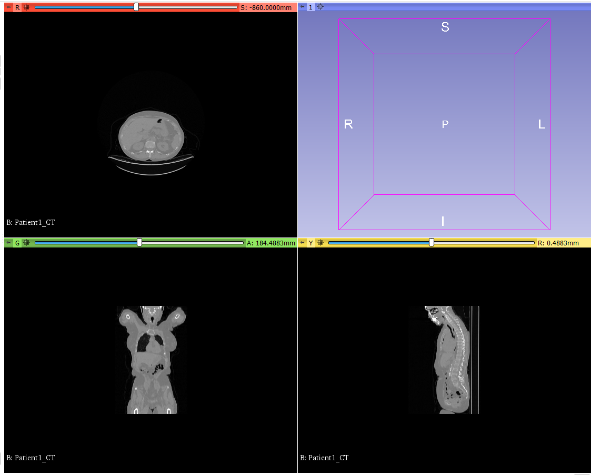
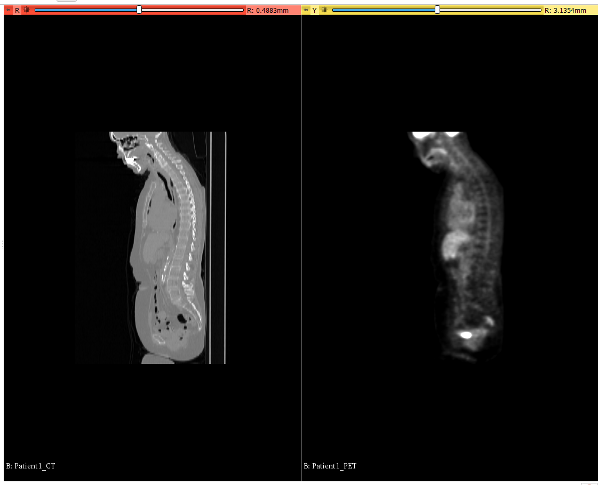
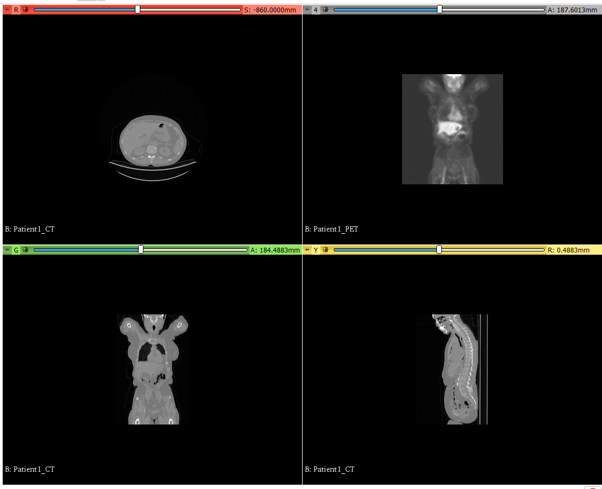
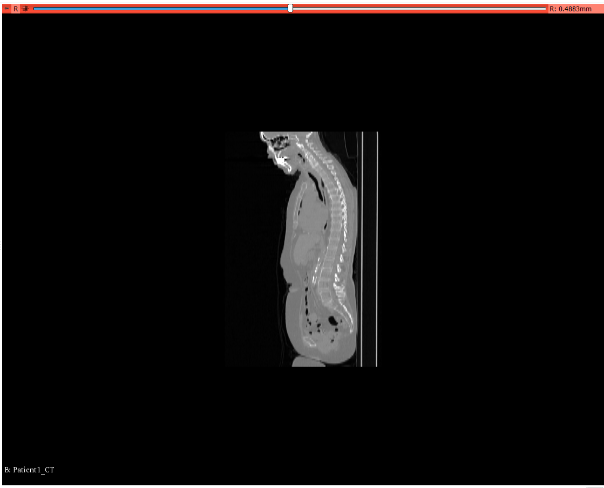

---
hide:
- toc
---
<!-- let javascript handle toc on left sidebar -->
# Layouts

The Image Quizzer enables you to define the configuration of viewing windows to be
displayed. The different layouts available are shown in the examples below.

Following are the window assignments available for each of the layouts. These window names
are used in the [DefaultDestination](../elements_attributes/image/default_destination.md) element.

| Layout option | Viewing windows for DefaultDestination|
| ---|---|
| FourUp | Red, Green, and Yellow|
| TwoOverTwo | Red, Green, Yellow, and Slice4 |
| OneUpRedSlice | Red |
| SideBySideRedYellow | Red and Yellow |


Other attributes that are associated with how the images are displayed include:

- [Layout](../elements_attributes/page/layout.md)
- [DefaultDestination](../elements_attributes/image/default_destination.md)
    - which viewing window to place the image (Red, Green, Yellow, or Slice4)
- [DefaultOrientation](../elements_attributes/image/default_orientation.md)
    - what orientation to present the image (Axial, Sagittal, or Coronal)
- [Layer](../elements_attributes/image/layer.md)
    - option to assign image to a layer (Background, Foreground, Segmentation, or LabelMap)
	
	


## Prep

Download the PETCTFusion-Tutorial-Data dataset as described in the [sample data](sample_data.md#tutorial-data-links) section.

Extract the PETCTFusion-Tutorial-Data to a subfolder under ImageVolumes/ as shown.

```
.
└─ ImageQuizzerData/
      └─ ImageVolumes/
          └─ PETCTFusion-Tutorial-Data/
                └─ PETCTFusion/
                      └─ CT1/
                         ├─ 26556672
                         ├─ 26556691
				         ├─ ...
                      └─ CT2/
                      └─ PET1/
                         ├─ 26558596
                         ├─ 26558607
				         ├─ ...
                     └─ PET2/
```

## Script examples

Layout="FourUp"

```
<Session>
	<Page ID="Patient1" Descriptor="PET-CT" Layout="FourUp">
		<Image DicomRead="Y" Type="Volume" ID="CT">
			<DefaultDestination>Red</DefaultDestination>
			<Layer>Background</Layer>
			<DefaultOrientation>Axial</DefaultOrientation>
			<Path>ImageVolumes\PETCTFusion-Tutorial-Data\PETCTFusion\CT1\26556672</Path>
		</Image>
		<Image DicomRead="Y" ID="CT" Type="Volume">
			<DefaultDestination>Green</DefaultDestination>
			<Layer>Background</Layer>
			<DefaultOrientation>Coronal</DefaultOrientation>
			<Path>ImageVolumes\PETCTFusion-Tutorial-Data\PETCTFusion\CT1\26556672</Path>
		</Image>
		<Image DicomRead="Y" ID="CT" Type="Volume">
			<DefaultDestination>Yellow</DefaultDestination>
			<Layer>Background</Layer>
			<DefaultOrientation>Sagittal</DefaultOrientation>
			<Path>ImageVolumes\PETCTFusion-Tutorial-Data\PETCTFusion\CT1\26556672</Path>
		</Image>
	</Page>
</Session>
```


```
>>>>>>>>>>>>>>>>>>>>>>>>>>>>>>>>>>>>>>>>>>>>>>>>>>>>>>>>>>>>>>>>>>>>>>
```

Layout="SideBySideRedYellow"
```
<Session>
	<Page ID="Patient1" Descriptor="PET-CT" Layout="SideBySideRedYellow">
		<Image DicomRead="Y" Type="Volume" ID="CT">
			<DefaultDestination>Red</DefaultDestination>
			<Layer>Background</Layer>
			<DefaultOrientation>Sagittal</DefaultOrientation>
			<Path>ImageVolumes\PETCTFusion-Tutorial-Data\PETCTFusion\CT1\26556672</Path>
		</Image>
		<Image DicomRead="Y" Type="Volume" ID="PET">
			<DefaultDestination>Yellow</DefaultDestination>
			<Layer>Background</Layer>
			<DefaultOrientation>Sagittal</DefaultOrientation>
			<Path>ImageVolumes\PETCTFusion-Tutorial-Data\PETCTFusion\PET1\26558596</Path>
		</Image>
	</Page>
</Session>
```




```
>>>>>>>>>>>>>>>>>>>>>>>>>>>>>>>>>>>>>>>>>>>>>>>>>>>>>>>>>>>>>>>>>>>>>>
```

Layout="TwoOverTwo"
```
<Session>
	<Page ID="Patient1" Descriptor="PET-CT" Layout="TwoOverTwo">
		<Image DicomRead="Y" Type="Volume" ID="CT">
			<DefaultDestination>Red</DefaultDestination>
			<Layer>Background</Layer>
			<DefaultOrientation>Axial</DefaultOrientation>
			<Path>ImageVolumes\PETCTFusion-Tutorial-Data\PETCTFusion\CT1\26556672</Path>
		</Image>
		<Image DicomRead="Y" ID="CT" Type="Volume">
			<DefaultDestination>Green</DefaultDestination>
			<Layer>Background</Layer>
			<DefaultOrientation>Coronal</DefaultOrientation>
			<Path>ImageVolumes\PETCTFusion-Tutorial-Data\PETCTFusion\CT1\26556672</Path>
		</Image>
		<Image DicomRead="Y" ID="CT" Type="Volume">
			<DefaultDestination>Yellow</DefaultDestination>
			<Layer>Background</Layer>
			<DefaultOrientation>Sagittal</DefaultOrientation>
			<Path>ImageVolumes\PETCTFusion-Tutorial-Data\PETCTFusion\CT1\26556672</Path>
		</Image>
		<Image DicomRead="Y" ID="PET" Type="Volume">
			<DefaultDestination>Slice4</DefaultDestination>
			<Layer>Background</Layer>
			<DefaultOrientation>Coronal</DefaultOrientation>
			<Path>ImageVolumes\PETCTFusion-Tutorial-Data\PETCTFusion\PET1\26558596</Path>
		</Image>
	</Page>
</Session>
```



```
>>>>>>>>>>>>>>>>>>>>>>>>>>>>>>>>>>>>>>>>>>>>>>>>>>>>>>>>>>>>>>>>>>>>>>
```

Layout="OneUpRedSlice"
```
<Session>
	<Page ID="Patient1" Descriptor="CT" Layout="OneUpRedSlice">
		<Image DicomRead="Y" Type="Volume" ID="CT">
			<DefaultDestination>Red</DefaultDestination>
			<Layer>Background</Layer>
			<DefaultOrientation>Sagittal</DefaultOrientation>
			<Path>ImageVolumes\PETCTFusion-Tutorial-Data\PETCTFusion\CT1\26556672</Path>
		</Image>
	</Page>
</Session>
```



