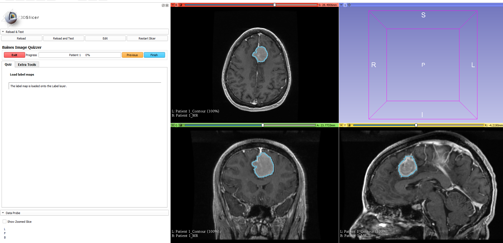
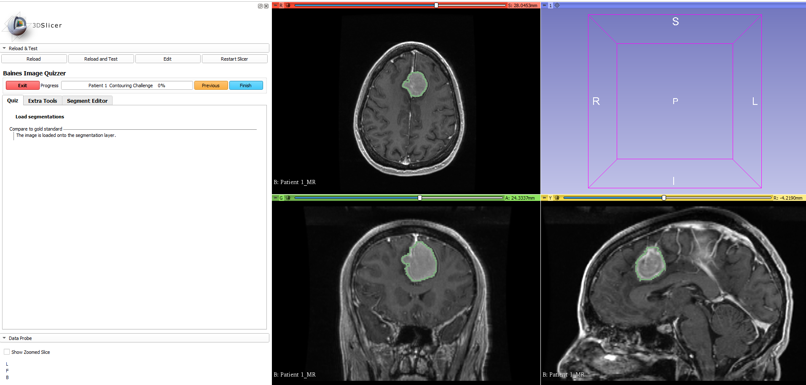

---
hide:
- toc
---
<!-- let javascript handle toc on left sidebar -->
# Load label maps and segmentations

Image files that highlight regions of interest (ROIs) ROIs can be stored in a variety of formats.
ROIs stored as discrete values (mask) cam be loaded as Type="LabelMap" on the Label layer. 
ROIs stored in segmentation or RTStruct files are loaded as Type="Segmentation" or Type="RTStruct" respectively on the Segmentation layer.

Following are script examples on how to load image files as label maps or as segmentations.


## Prep

Download and save Slicer's [RECIST dataset](sample_data.md#tutorial-data-links) as described in the [sample data suggested tree structure](sample_data.md#suggested-tree-structure) section.

Suggested folder structure to match script:

```
.
└─ ImageDatabase/
    └─ ImageVolumes/
        └─ RECIST-Tutorial-Data/
            ├─ 1007-spgr.nrrd
			└─ 1007-spgr.label.nrrd   
```

## Script examples

### Label maps

```
<Session>
    <Page ID="Patient 1" >
        <Image ID="MR" Type="Volume">
                <DefaultDestination>Red</DefaultDestination>
                <Layer>Background</Layer>
                <DefaultOrientation>Axial</DefaultOrientation>
                <Path>ImageVolumes\RECIST-Tutorial-Data\2007-spgr.nrrd</Path>
        </Image>
        <Image ID="MR" Type="Volume">
                <DefaultDestination>Green</DefaultDestination>
                <Layer>Background</Layer>
                <DefaultOrientation>Coronal</DefaultOrientation>
                <Path>ImageVolumes\RECIST-Tutorial-Data\2007-spgr.nrrd</Path>
        </Image>
        <Image ID="MR" Type="Volume">
                <DefaultDestination>Yellow</DefaultDestination>
                <Layer>Background</Layer>
                <DefaultOrientation>Sagittal</DefaultOrientation>
                <Path>ImageVolumes\RECIST-Tutorial-Data\2007-spgr.nrrd</Path>
        </Image>
        <Image ID="Contour" Type="LabelMap">
                <DefaultDestination>Red</DefaultDestination>
                <Layer>Label</Layer>
                <DefaultOrientation>Axial</DefaultOrientation>
                <Path>ImageVolumes\RECIST-Tutorial-Data\2007-spgr.label.nrrd</Path>
        </Image>
        <Image ID="Contour" Type="LabelMap">
                <DefaultDestination>Green</DefaultDestination>
                <Layer>Label</Layer>
                <DefaultOrientation>Coronal</DefaultOrientation>
                <Path>ImageVolumes\RECIST-Tutorial-Data\2007-spgr.label.nrrd</Path>
        </Image>
        <Image ID="Contour" Type="LabelMap">
                <DefaultDestination>Yellow</DefaultDestination>
                <Layer>Label</Layer>
                <DefaultOrientation>Sagittal</DefaultOrientation>
                <Path>ImageVolumes\RECIST-Tutorial-Data\2007-spgr.label.nrrd</Path>
        </Image>
        <QuestionSet Descriptor="Load label maps">
            <Question Type="InfoBox">
                <Option>The label map is loaded onto the Label layer.</Option>
            </Question>
        </QuestionSet>
    </Page>
</Session>


```

### Display results  - label maps

All ROIs with distinct values stored in the label map image file are displayed.


```
>>>>>>>>>>>>>>>>>>>>>>>>>>>>>>>>>>>>>>>>>>>>>>>>>>>>>>>>>>>>>>>>>>>>>>>


```



```
>>>>>>>>>>>>>>>>>>>>>>>>>>>>>>>>>>>>>>>>>>>>>>>>>>>>>>>>>>>>>>>>>>>>>>>
```

### Segmentations

If loading a volume with ROIs as a Segmentation you must have the ROIVisibilityCode element defined in the XML quiz.
With this element, you have the advantage of defining which ROIs to show or hide.


For more informatio on ROI visibility codes, see [ROI Visibility Example](example_roi_visibility.md)

```
<Session>
    <Page ID="Patient 1" Descriptor="Contouring Challenge"  EnableSegmentEditor="Y">
        <Image Type="Volume" ID="MR" RotateToAcquisition="Y">
            <DefaultDestination>Red</DefaultDestination>
            <Layer>Background</Layer>
            <DefaultOrientation>Axial</DefaultOrientation>
            <Path>ImageVolumes\RECIST-Tutorial-Data\2007-spgr.nrrd</Path>
        </Image>
        <Image Type="Volume" ID="MR" RotateToAcquisition="Y">
            <DefaultDestination>Green</DefaultDestination>
            <Layer>Background</Layer>
            <DefaultOrientation>Coronal</DefaultOrientation>
            <Path>ImageVolumes\RECIST-Tutorial-Data\2007-spgr.nrrd</Path>
        </Image>
        <Image Type="Volume" ID="MR" RotateToAcquisition="Y">
            <DefaultDestination>Yellow</DefaultDestination>
            <Layer>Background</Layer>
            <DefaultOrientation>Sagittal</DefaultOrientation>
            <Path>ImageVolumes\RECIST-Tutorial-Data\2007-spgr.nrrd</Path>
        </Image>
        <Image Type="Segmentation" ID="Gold" RotateToAcquisition="Y">
            <DefaultDestination>Red</DefaultDestination>
            <Layer>Segmentation</Layer>
            <Path>ImageVolumes\RECIST-Tutorial-Data\2007-spgr.label.nrrd</Path>
            <ROIs ROIVisibilityCode='All'></ROIs>
        </Image>
        <Image Type="Segmentation" ID="Gold" RotateToAcquisition="Y">
            <DefaultDestination>Green</DefaultDestination>
            <Layer>Segmentation</Layer>
            <Path>ImageVolumes\RECIST-Tutorial-Data\2007-spgr.label.nrrd</Path>
            <ROIs ROIVisibilityCode='All'></ROIs>
        </Image>
        <Image Type="Segmentation" ID="Gold" RotateToAcquisition="Y">
            <DefaultDestination>Yellow</DefaultDestination>
            <Layer>Segmentation</Layer>
            <Path>ImageVolumes\RECIST-Tutorial-Data\2007-spgr.label.nrrd</Path>
            <ROIs ROIVisibilityCode='All'></ROIs>
        </Image>
        <QuestionSet Descriptor="Load segmentations">
            <Question Type="InfoBox" Descriptor="Compare to gold standard">
                <Option>The image is loaded onto the segmentation layer.</Option>
            </Question>
        </QuestionSet>
    </Page>
</Session>
```


### Display results  - segmentations


```
>>>>>>>>>>>>>>>>>>>>>>>>>>>>>>>>>>>>>>>>>>>>>>>>>>>>>>>>>>>>>>>>>>>>>>>


```



```
>>>>>>>>>>>>>>>>>>>>>>>>>>>>>>>>>>>>>>>>>>>>>>>>>>>>>>>>>>>>>>>>>>>>>>>
```


## See also

For loading an RTStruct example, see [Image Type](../elements_attributes/image/type.md#examples)
