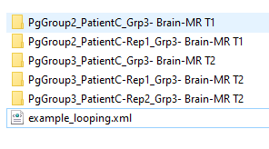

---
hide:
- toc
---
<!-- let javascript handle toc on left sidebar -->
# Looping pages

Image Quizzer has the ability to allow the users to *Repeat* a page if for example you want the user 
to contour all regions of interest they find on one image and answer the same questions for each.

To do this, assign the [Loop](../elements_attributes/page/loop.md) attribute to "Y" in the Page element: 

The **Repeat** button is visible on a Page that has Loop="Y" and becomes enabled when the last question set is displayed.

When the **Repeat** button is pressed by the user, the Image Quizzer will ensure that all quiz questions and required
annotations are complete before proceding. Then it will make a copy of the Page and add a suffix of *-RepN* (where N is the number of
the repetition) to the Page ID attribute. The Response elements and any LabelMapPath and MarkupLinePath elements are stripped out of the new Page - ready
for the user's new responses.


## Prep

For the following example, we will use the CT-MR Brain sample dataset that is available when you open Slicer.	

Download and save the dataset as described in the [sample data](sample_data.md#slicer-sample-datasets) section
to a subfolder under ImageVolumes/ as shown.

```
.
└─ ImageQuizzerData/
      └─ ImageVolumes/
          └─ CT-MR Brain/
               ├─ CTBrain.nrrd
               ├─ MRBrainT1.nrrd
               └─ MRBrainT2.nrrd
```

## Script example

For this quiz example, we will present each image for this patient on a different page with Loop="Y" only on the pages displaying the MR images.
This could be an observer study to compare an observer's ability to detect and classify lesions on different modalities. 

```

```

### Results tree structure




```
PatientC_MR T1-bainesquizlabel.nrrd

PatientC-Rep1_MR T1-bainesquizlabel.nrrd

PatientC_MR T2-bainesquizlabel.nrrd


```

### Results quiz file

```
	<Session UserName="cjohnson">
		<Page Descriptor="Grp3- Brain-CT" ID="PatientC" Layout="OneUpRedSlice" PageComplete="Y" PageGroup="1" Rep="0">
			<Image ID="CT" Type="Volume">
				<Layer>Background</Layer>
				<DefaultDestination>Red</DefaultDestination>
				<DefaultOrientation>Axial</DefaultOrientation>
				<Path>ImageVolumes\CT-MR Brain\CTBrain.nrrd</Path>
				<State Destination="Red" Level="-1855.5625" LoginTime="20230321_16:40:13.224042" Orientation="Axial" ResponseTime="20230321_16:41:06.370915" SliceOffset="-41.66604979395833" ViewingMode="Default" Window="5253.323863636366"/>
			</Image>
			<QuestionSet Descriptor="Lesions detected on CT" ID="Lesions">
				<Question Descriptor="Total" Min="0" Type="IntegerValue">
					<Option>
						Enter the number of lesions detected:
						<Response LoginTime="20230321_16:40:13.224042" ResponseTime="20230321_16:41:06.368419">1</Response>
					</Option>
				</Question>
			</QuestionSet>
		</Page>
		<Page Descriptor="Grp3- Brain-MR T1" EnableSegmentEditor="Y" ID="PatientC" Layout="OneUpRedSlice" Loop="Y" PageComplete="Y" PageGroup="2" Rep="0">
			<Image ID="MR T1" Type="Volume">
				<Layer>Background</Layer>
				<DefaultDestination>Red</DefaultDestination>
				<DefaultOrientation>Axial</DefaultOrientation>
				<Path>ImageVolumes\CT-MR Brain\MRBrainT1.nrrd</Path>
				<LabelMapPath LoginTime="20230321_16:40:13.224042" ResponseTime="20230321_16:43:13.075922">example_looping\PgGroup2_PatientC_Grp3- Brain-MR T1\PatientC_MR T1-bainesquizlabel.nrrd</LabelMapPath>
				<State Destination="Red" Level="269.5113636363636" LoginTime="20230321_16:40:13.224042" Orientation="Axial" ResponseTime="20230321_16:43:13.139537" SliceOffset="-13.069520903423077" ViewingMode="Default" Window="349.8636363636364"/>
			</Image>
			<QuestionSet Descriptor="Lesions detected on T1W MR" ID="Lesions">
				<Question Type="InfoBox">
					<Option>
						Contour and classify one lesion.
						<Response LoginTime="20230321_16:40:13.224042" ResponseTime="20230321_16:43:13.087400"/>
					</Option>
					<Option>
						Use the repeat button if multiple lesions exist.
						<Response LoginTime="20230321_16:40:13.224042" ResponseTime="20230321_16:43:13.087400"/>
					</Option>
				</Question>
				<Question Descriptor="Classification" Type="Radio">
					<Option>
						Primary
						<Response LoginTime="20230321_16:40:13.224042" ResponseTime="20230321_16:43:13.087400">Y</Response>
					</Option>
					<Option>
						Metasasis
						<Response LoginTime="20230321_16:40:13.224042" ResponseTime="20230321_16:43:13.087400">N</Response>
					</Option>
				</Question>
			</QuestionSet>
		</Page>
		<Page Descriptor="Grp3- Brain-MR T1" EnableSegmentEditor="Y" ID="PatientC-Rep1" Layout="OneUpRedSlice" Loop="Y" PageComplete="Y" PageGroup="2" Rep="1">
			<Image ID="MR T1" Type="Volume">
				<Layer>Background</Layer>
				<DefaultDestination>Red</DefaultDestination>
				<DefaultOrientation>Axial</DefaultOrientation>
				<Path>ImageVolumes\CT-MR Brain\MRBrainT1.nrrd</Path>
				<State Destination="Red" Level="269.5113636363636" LoginTime="20230321_16:40:13.224042" Orientation="Axial" ResponseTime="20230321_16:43:13.139537" SliceOffset="-13.069520903423077" ViewingMode="Default" Window="349.8636363636364"/>
				<LabelMapPath LoginTime="20230321_16:40:13.224042" ResponseTime="20230321_16:43:44.170952">example_looping\PgGroup2_PatientC-Rep1_Grp3- Brain-MR T1\PatientC-Rep1_MR T1-bainesquizlabel.nrrd</LabelMapPath>
				<State Destination="Red" Level="269.5113636363636" LoginTime="20230321_16:40:13.224042" Orientation="Axial" ResponseTime="20230321_16:43:44.217363" SliceOffset="-14.007020903422983" ViewingMode="Default" Window="349.8636363636364"/>
			</Image>
			<QuestionSet Descriptor="Lesions detected on T1W MR" ID="Lesions">
				<Question Type="InfoBox">
					<Option>
						Contour and classify one lesion.
						<Response LoginTime="20230321_16:40:13.224042" ResponseTime="20230321_16:43:44.183927"/>
					</Option>
					<Option>
						Use the repeat button if multiple lesions exist.
						<Response LoginTime="20230321_16:40:13.224042" ResponseTime="20230321_16:43:44.183927"/>
					</Option>
				</Question>
				<Question Descriptor="Classification" Type="Radio">
					<Option>
						Primary
						<Response LoginTime="20230321_16:40:13.224042" ResponseTime="20230321_16:43:44.183927">N</Response>
					</Option>
					<Option>
						Metasasis
						<Response LoginTime="20230321_16:40:13.224042" ResponseTime="20230321_16:43:44.183927">Y</Response>
					</Option>
				</Question>
			</QuestionSet>
		</Page>
		<Page Descriptor="Grp3- Brain-MR T2" EnableSegmentEditor="Y" ID="PatientC" Layout="OneUpRedSlice" Loop="Y" PageComplete="Y" PageGroup="3" Rep="0">
			<Image ID="MR T2" Type="Volume">
				<Layer>Background</Layer>
				<DefaultDestination>Red</DefaultDestination>
				<DefaultOrientation>Axial</DefaultOrientation>
				<Path>ImageVolumes\CT-MR Brain\MRBrainT2.nrrd</Path>
				<LabelMapPath LoginTime="20230321_16:40:13.224042" ResponseTime="20230321_16:44:17.563632">example_looping\PgGroup3_PatientC_Grp3- Brain-MR T2\PatientC_MR T2-bainesquizlabel.nrrd</LabelMapPath>
				<State Destination="Red" Level="440.5" LoginTime="20230321_16:40:13.224042" Orientation="Axial" ResponseTime="20230321_16:44:17.609544" SliceOffset="-11.95652695110362" ViewingMode="Default" Window="881.0"/>
			</Image>
			<QuestionSet Descriptor="Lesions detected on T2W MR" ID="Lesions">
				<Question Type="InfoBox">
					<Option>
						Contour and classify one lesion.
						<Response LoginTime="20230321_16:40:13.224042" ResponseTime="20230321_16:44:17.577106"/>
					</Option>
					<Option>
						Use the repeat button if multiple lesions exist.
						<Response LoginTime="20230321_16:40:13.224042" ResponseTime="20230321_16:44:17.577106"/>
					</Option>
				</Question>
				<Question Descriptor="Classification" Type="Radio">
					<Option>
						Primary
						<Response LoginTime="20230321_16:40:13.224042" ResponseTime="20230321_16:44:17.577106">Y</Response>
					</Option>
					<Option>
						Metasasis
						<Response LoginTime="20230321_16:40:13.224042" ResponseTime="20230321_16:44:17.577106">N</Response>
					</Option>
				</Question>
			</QuestionSet>
		</Page>
		<Login LoginTime="20230321_16:40:13.224042" LogoutTime="20230321_16:45:05.681340" QuizComplete="Y"/>
		<Page Descriptor="Grp3- Brain-MR T2" EnableSegmentEditor="Y" ID="PatientC-Rep1" Layout="OneUpRedSlice" Loop="Y" PageComplete="Y" PageGroup="3" Rep="1">
			<Image ID="MR T2" Type="Volume">
				<Layer>Background</Layer>
				<DefaultDestination>Red</DefaultDestination>
				<DefaultOrientation>Axial</DefaultOrientation>
				<Path>ImageVolumes\CT-MR Brain\MRBrainT2.nrrd</Path>
				<State Destination="Red" Level="440.5" LoginTime="20230321_16:40:13.224042" Orientation="Axial" ResponseTime="20230321_16:44:17.609544" SliceOffset="-11.95652695110362" ViewingMode="Default" Window="881.0"/>
				<LabelMapPath LoginTime="20230321_16:40:13.224042" ResponseTime="20230321_16:44:41.532751">example_looping\PgGroup3_PatientC-Rep1_Grp3- Brain-MR T2\PatientC-Rep1_MR T2-bainesquizlabel.nrrd</LabelMapPath>
				<State Destination="Red" Level="440.5" LoginTime="20230321_16:40:13.224042" Orientation="Axial" ResponseTime="20230321_16:44:41.578163" SliceOffset="-7.966527418404027" ViewingMode="Default" Window="881.0"/>
			</Image>
			<QuestionSet Descriptor="Lesions detected on T2W MR" ID="Lesions">
				<Question Type="InfoBox">
					<Option>
						Contour and classify one lesion.
						<Response LoginTime="20230321_16:40:13.224042" ResponseTime="20230321_16:44:41.548221"/>
					</Option>
					<Option>
						Use the repeat button if multiple lesions exist.
						<Response LoginTime="20230321_16:40:13.224042" ResponseTime="20230321_16:44:41.548221"/>
					</Option>
				</Question>
				<Question Descriptor="Classification" Type="Radio">
					<Option>
						Primary
						<Response LoginTime="20230321_16:40:13.224042" ResponseTime="20230321_16:44:41.548221">N</Response>
					</Option>
					<Option>
						Metasasis
						<Response LoginTime="20230321_16:40:13.224042" ResponseTime="20230321_16:44:41.548221">Y</Response>
					</Option>
				</Question>
			</QuestionSet>
		</Page>
		<Page Descriptor="Grp3- Brain-MR T2" EnableSegmentEditor="Y" ID="PatientC-Rep2" Layout="OneUpRedSlice" Loop="Y" PageComplete="Y" PageGroup="3" Rep="2">
			<Image ID="MR T2" Type="Volume">
				<Layer>Background</Layer>
				<DefaultDestination>Red</DefaultDestination>
				<DefaultOrientation>Axial</DefaultOrientation>
				<Path>ImageVolumes\CT-MR Brain\MRBrainT2.nrrd</Path>
				<State Destination="Red" Level="440.5" LoginTime="20230321_16:40:13.224042" Orientation="Axial" ResponseTime="20230321_16:44:17.609544" SliceOffset="-11.95652695110362" ViewingMode="Default" Window="881.0"/>
				<State Destination="Red" Level="440.5" LoginTime="20230321_16:40:13.224042" Orientation="Axial" ResponseTime="20230321_16:44:41.578163" SliceOffset="-7.966527418404027" ViewingMode="Default" Window="881.0"/>
				<LabelMapPath LoginTime="20230321_16:40:13.224042" ResponseTime="20230321_16:45:05.663666">example_looping\PgGroup3_PatientC-Rep2_Grp3- Brain-MR T2\PatientC-Rep2_MR T2-bainesquizlabel.nrrd</LabelMapPath>
				<State Destination="Red" Level="440.5" LoginTime="20230321_16:40:13.224042" Orientation="Axial" ResponseTime="20230321_16:45:05.714776" SliceOffset="-7.966527418404029" ViewingMode="Default" Window="881.0"/>
			</Image>
			<QuestionSet Descriptor="Lesions detected on T2W MR" ID="Lesions">
				<Question Type="InfoBox">
					<Option>
						Contour and classify one lesion.
						<Response LoginTime="20230321_16:40:13.224042" ResponseTime="20230321_16:45:05.681340"/>
					</Option>
					<Option>
						Use the repeat button if multiple lesions exist.
						<Response LoginTime="20230321_16:40:13.224042" ResponseTime="20230321_16:45:05.681340"/>
					</Option>
				</Question>
				<Question Descriptor="Classification" Type="Radio">
					<Option>
						Primary
						<Response LoginTime="20230321_16:40:13.224042" ResponseTime="20230321_16:45:05.681340">N</Response>
					</Option>
					<Option>
						Metasasis
						<Response LoginTime="20230321_16:40:13.224042" ResponseTime="20230321_16:45:05.681340">Y</Response>
					</Option>
				</Question>
			</QuestionSet>
		</Page>
	</Session>

```

