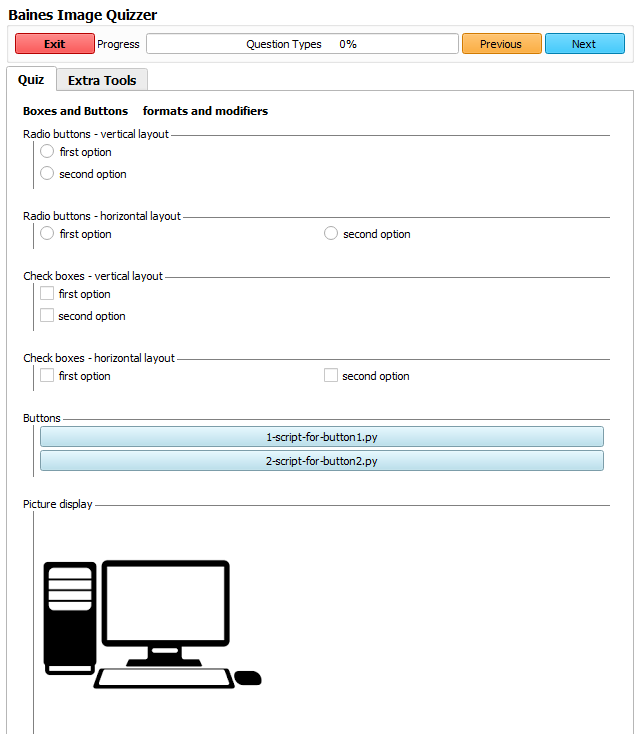
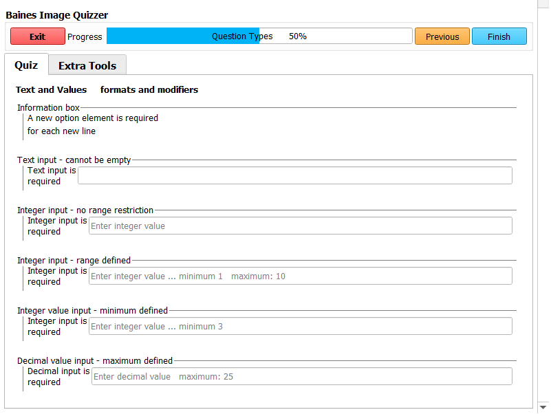

---
hide:
- toc
---
<!-- let javascript handle toc on left sidebar -->
# Question types

This example shows the different formats available for presenting the quiz questions.

See the table listing all available [question types](../elements_attributes/questionset/question/type.md).


## Prep

For this quiz to run, there must be files in the Scripts and MasterQuiz directories as shown.
(These can be empty placeholder files.) 
There are no images being loaded. No sample datasets are required.

```
.
└─ ImageQuizzer/
    └─ Inputs/
        └─ MasterQuiz/
			├─ ScriptExampleQuiz.xml
			└─ computer.png
        └─ Scripts/
			├─ script-for-button1.py
			└─ script-for-button1.py
			
```


## Script example

```
<Session>
    <Page ID="Question Types">
        <QuestionSet ID="Boxes and Buttons" Descriptor="formats and modifiers">
            <Question Descriptor="Radio buttons - vertical layout" Type="Radio" GroupLayout="Vertical">
                <Option>first option</Option>
                <Option>second option</Option>
            </Question>
            <Question Descriptor="Radio buttons - horizontal layout" Type="Radio" GroupLayout="Horizontal">
                <Option>first option</Option>
                <Option>second option</Option>
            </Question>
            <Question Descriptor="Check boxes - vertical layout" Type="CheckBox" GroupLayout="Vertical">
                <Option>first option</Option>
                <Option>second option</Option>
            </Question>
            <Question Descriptor="Check boxes - horizontal layout" Type="CheckBox" GroupLayout="Horizontal">
                <Option>first option</Option>
                <Option>second option</Option>
            </Question>
            <Question Descriptor="Buttons" Type="Button">
                <Option>script-for-button1.py</Option>
                <Option>script-for-button2.py</Option>
            </Question>
			<Question Descriptor="Picture display" Type="Picture">
				<Option>legend.png</Option>
			</Question>
        </QuestionSet>
        <QuestionSet ID="Text and Values" Descriptor="formats and modifiers">
            <Question Descriptor="Information box" Type="InfoBox">
                <Option>A new option element is required</Option>
                <Option>for each new line</Option>
            </Question>
            <Question Descriptor="Text input" Type="Text">
                <Option>Text input is required - cannot be empty</Option>
            </Question>
            <Question Descriptor="Integer input - no range restriction" Type="IntegerValue">
                <Option>Integer input is required</Option>
            </Question>
            <Question Descriptor="Integer input - range defined" Type="IntegerValue" Min="1" Max="10">
                <Option>Integer input is required</Option>
            </Question>
            <Question Descriptor="Integer value input - minimum defined" Type="IntegerValue" Min="3">
                <Option>Integer input is required</Option>
            </Question>
            <Question Descriptor="Decimal value input - maximum defined" Type="FloatValue" Max="25">
                <Option>Decimal input is required</Option>
            </Question>
        </QuestionSet>
    </Page>
</Session>
```

## Quiz display results

```
>>>>>>>>>>>>>>>>>>>>>>>>>>>>>>>>>>>>>>>>>>>>>>>>>>>>>>>>>>>>>>>>>>>>
Display from first question set with radio buttons and check boxes.
>>>>>>>>>>>>>>>>>>>>>>>>>>>>>>>>>>>>>>>>>>>>>>>>>>>>>>>>>>>>>>>>>>>>
```




```
>>>>>>>>>>>>>>>>>>>>>>>>>>>>>>>>>>>>>>>>>>>>>>>>>>>>>>>>>>>>>>>>>>>>>>>>>>>>>>>>>>>
Display from second question set with info, text boxes and numeric input values.
>>>>>>>>>>>>>>>>>>>>>>>>>>>>>>>>>>>>>>>>>>>>>>>>>>>>>>>>>>>>>>>>>>>>>>>>>>>>>>>>>>>
```


