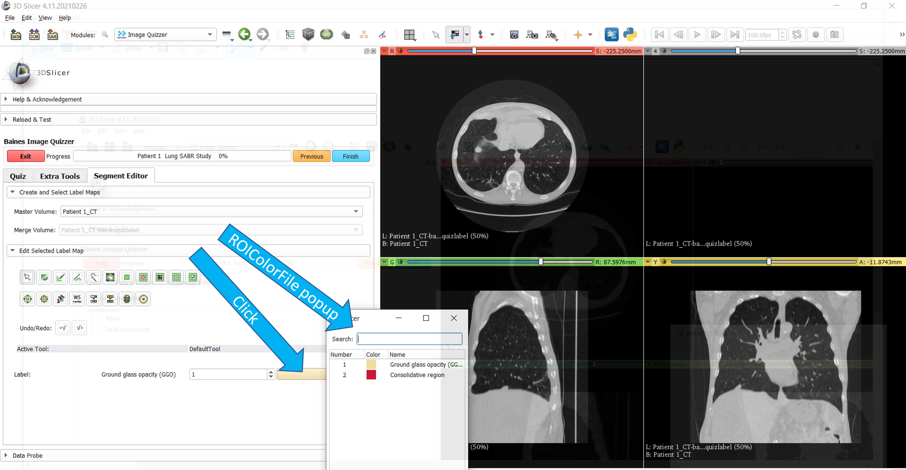

---
hide:
- toc
---
<!-- let javascript handle toc on left sidebar -->
# ROI Color File

This example shows the setup of a lung study where the user must segment two regions of interest.
When in the Segment Editor tab, only 2 colors options are presented to the user.

The main attributes of interest used for this example include:

- ROIColorFile="Lung_SABR_Study_colors"
    - an attribute in the Session root element
	- name of the file holding color rgba definition
	- there is no .txt extension in this attribute
- EnableSegmentEditor="Y"
    - to open the Segment Editor tab in the Image Quizzer
- SegmentRequiredOnAnyImage="Y"
    - the user cannot advance to the next Page of images and questions until
	a contour has been created on any of the images displayed
	


## Prep

Download and save Slicer's CTChest [sample data](../../getting_started/index.md#sample-datasets).

## ROI Color File

Create the color text file.
Format: roi# roiName red green blue alpha

Place this file in the same directory where the master quiz file is located.

```
Lung_SABR_Study_colors.txt

1 Ground_glass_opacity_(GGO) 241 214 145 255
2 Consolidative_region 191 2 34 255

```

## Script

```
Lung_SABR.xml

<Session ROIColorFile="Lung_SABR_Study_colors"
	<Page ID="Patient 1" Descriptor="Lung SABR Study" EnableSegmentEditor="Y" SegmentRequiredOnAnyImage="Y">
		<Image ID="CT" Type="Volume">
				<DefaultDestination>Red</DefaultDestination>
				<Layer>Background</Layer>
				<DefaultOrientation>Axial</DefaultOrientation>
				<Path>ImageVolumes\CTChest\CTChest.nrrd</Path>
		</Image>
		<Image ID="CT" Type="Volume">
				<DefaultDestination>Green</DefaultDestination>
				<Layer>Background</Layer>
				<DefaultOrientation>Sagittal</DefaultOrientation>
				<Path>ImageVolumes\CTChest\CTChest.nrrd</Path>
		</Image>
		<Image ID="CT" Type="Volume">
				<DefaultDestination>Yellow</DefaultDestination>
				<Layer>Background</Layer>
				<DefaultOrientation>Coronal</DefaultOrientation>
				<Path>ImageVolumes\CTChest\CTChest.nrrd</Path>
		</Image>
		<QuestionSet Descriptor="Lung SABR Study">
			<Question Descriptor="Assessment" Type="Radio">
				<Option>Injury</Option>
				<Option>Local recurrence</Option>
			</Question>
		</QuestionSet>
	</Page>
</Session>
```

## Display results

Screenshot of quiz options:


Screenshot of ROI color options:




## See also

[ROI Color File](../elements_attributes/session/roi_colorfile.md)
[EnableSegmentEditor](../elements_attributes/page/enable_segment_editor.md)
[SegmentRequiredOnAnyImage](../elements_attributes/page/segment_required_on_any_image.md)
