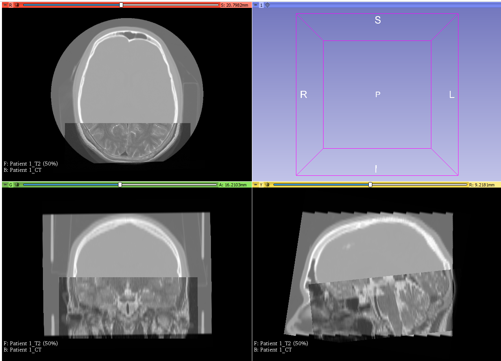
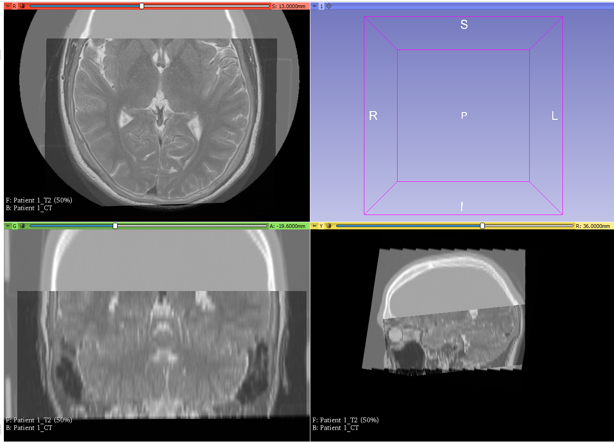

---
hide:
- toc
---
<!-- let javascript handle toc on left sidebar -->
# Zoom, Pan and Slice Offset

This example shows how to use the Image attributes
 [ZoomFactor](../elements_attributes/image/zoom_factor.md), [PanOrigin](../elements_attributes/image/pan_origin.md) and [InitialSliceOffset](../elements_attributes/image/initial_slice_offset.md) to refocus the display
of the image when it is loaded.

## Prep

For the following example, we will use the CT-MR Brain sample dataset that is available when you open Slicer.	

Download and save the dataset as described in the [sample data](sample_data.md#slicer-sample-datasets) section
to a subfolder under ImageVolumes folder as shown.

```
.
└─ ImageQuizzerData/
      └─ ImageVolumes/
          └─ CT-MR Brain/
               ├─ CTBrain.nrrd
               ├─ MRBrainT1.nrrd
               └─ MRBrainT2.nrrd
```

## Script example

This script uses the image attributes [ZoomFactor](../elements_attributes/image/zoom_factor.md), [PanOrigin](../elements_attributes/image/pan_origin.md) and [InitialSliceOffset](../elements_attributes/image/initial_slice_offset.md). 

There are two pages. The first shows the images loaded without any adjustments and the second page sets the zoom / pan / and slice offset.
The MR-T2W images are set in the foreground to show how the foreground images follow the repositioning information for the background images.

```
<Session>
    <Page ID="Patient 1" Descriptor="Default load">
        <Image ID="CT" Type="Volume" >
                <DefaultDestination>Red</DefaultDestination>
                <Layer>Background</Layer>
                <DefaultOrientation>Axial</DefaultOrientation>
                <Path>ImageVolumes\CT-MR Brain\CTBrain.nrrd</Path>
        </Image>
        <Image ID="CT" Type="Volume">
                <DefaultDestination>Green</DefaultDestination>
                <Layer>Background</Layer>
                <DefaultOrientation>Coronal</DefaultOrientation>
                <Path>ImageVolumes\CT-MR Brain\CTBrain.nrrd</Path>
        </Image>
        <Image ID="CT" Type="Volume">
                <DefaultDestination>Yellow</DefaultDestination>
                <Layer>Background</Layer>
                <DefaultOrientation>Sagittal</DefaultOrientation>
                <Path>ImageVolumes\CT-MR Brain\CTBrain.nrrd</Path>
        </Image>
        <Image ID="T2" Type="Volume" >
                <DefaultDestination>Red</DefaultDestination>
                <Layer>Foreground</Layer>
                <DefaultOrientation>Axial</DefaultOrientation>
                <Path>ImageVolumes\CT-MR Brain\MRBrainT2.nrrd</Path>
        </Image>
        <Image ID="T2" Type="Volume">
                <DefaultDestination>Green</DefaultDestination>
                <Layer>Foreground</Layer>
                <DefaultOrientation>Coronal</DefaultOrientation>
                <Path>ImageVolumes\CT-MR Brain\MRBrainT2.nrrd</Path>
        </Image>
        <Image ID="T2" Type="Volume">
                <DefaultDestination>Yellow</DefaultDestination>
                <Layer>Foreground</Layer>
                <DefaultOrientation>Sagittal</DefaultOrientation>
                <Path>ImageVolumes\CT-MR Brain\MRBrainT2.nrrd</Path>
        </Image>
    </Page>
    <Page ID="Patient 1" Descriptor="Focused View">
        <Image ID="CT" Type="Volume" ZoomFactor="1.5" PanOrigin="-1.7 -28 0" InitialSliceOffset="13">
                <DefaultDestination>Red</DefaultDestination>
                <Layer>Background</Layer>
                <DefaultOrientation>Axial</DefaultOrientation>
                <Path>ImageVolumes\CT-MR Brain\CTBrain.nrrd</Path>
        </Image>
        <Image ID="CT" Type="Volume" ZoomFactor="1.7" PanOrigin="-2 -28 0" InitialSliceOffset="-19.6">
                <DefaultDestination>Green</DefaultDestination>
                <Layer>Background</Layer>
                <DefaultOrientation>Coronal</DefaultOrientation>
                <Path>ImageVolumes\CT-MR Brain\CTBrain.nrrd</Path>
        </Image>
        <Image ID="CT" Type="Volume" ZoomFactor=".8" PanOrigin="17 -35 0" InitialSliceOffset="36">
                <DefaultDestination>Yellow</DefaultDestination>
                <Layer>Background</Layer>
                <DefaultOrientation>Sagittal</DefaultOrientation>
                <Path>ImageVolumes\CT-MR Brain\CTBrain.nrrd</Path>
        </Image>
        <Image ID="T2" Type="Volume" >
                <DefaultDestination>Red</DefaultDestination>
                <Layer>Foreground</Layer>
                <DefaultOrientation>Axial</DefaultOrientation>
                <Path>ImageVolumes\CT-MR Brain\MRBrainT2.nrrd</Path>
        </Image>
        <Image ID="T2" Type="Volume" >
                <DefaultDestination>Green</DefaultDestination>
                <Layer>Foreground</Layer>
                <DefaultOrientation>Coronal</DefaultOrientation>
                <Path>ImageVolumes\CT-MR Brain\MRBrainT2.nrrd</Path>
        </Image>
        <Image ID="T2" Type="Volume">
                <DefaultDestination>Yellow</DefaultDestination>
                <Layer>Foreground</Layer>
                <DefaultOrientation>Sagittal</DefaultOrientation>
                <Path>ImageVolumes\CT-MR Brain\MRBrainT2.nrrd</Path>
        </Image>
    </Page>
</Session>


```

## Display results

```
>>> Page 1: BEFORE REPOSITIONING >>>>>>>>>>>>>>>>>>>>>>>>>>>>>>>>>>>>>>>>>>>>>>>>>>>>>>>>>>>>>>>>>>>
```



```
>>> Page 2: AFTER REPOSITIONING >>>>>>>>>>>>>>>>>>>>>>>>>>>>>>>>>>>>>>>>>>>>>>>>>>>>>>>>>>>>>>>>>>>>
```



```
>>>>>>>>>>>>>>>>>>>>>>>>>>>>>>>>>>>>>>>>>>>>>>>>>>>>>>>>>>>>>>>>>>>>>>>
```


