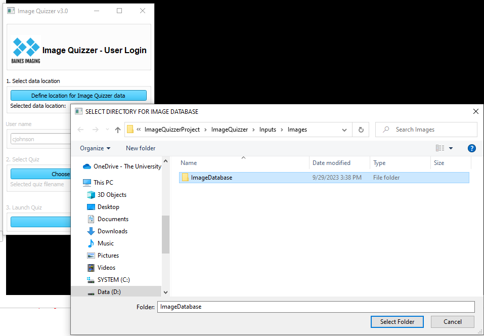

---
hide:
- toc
---
<!-- let javascript handle toc on left sidebar -->

# Sample Data

If you wish to run the Image Quizzer example quizzes, you can download and save the image volumes
using the instructions below.

Some datasets are accessed directly through the Slicer application and others
through the tutorial links provided.

## Suggested tree structure

This is the default location for the parent directory of the images database:

```
.
└─ ImageQuizzer/
    └─ Inputs/
        └─ Images/
            └─ ImageDatabase/
			
```
 
When the user logs in, they are directed to select the location of the data.




It is recommended that you save your data in a subfolder (e.g. ImageVolumes) below the parent database directory (ImageDatabase),
All paths in the example scripts are relative to this folder and begin with **ImageVolumes/...**.

This is an example of the tree structure used for building the example scripts.


```
.
└─ ImageDatabase/
   └─ ImageVolumes/
        ├─ MRHead/
        │   └─ MRHead.nrrd
        ├─ MRBrain/
        │   └─ MRBrain.nrrd
            ... etc.
        ├─ ExtractedSampleData1/
        └─ ExtractedSampleData2/

```


If you are using a tree structure with customized folder names,
you will have to modify the image **Path** element in the scripts to match your tree layout.


## Slicer sample datasets

Some of the sample datasets referenced to run the example scripts can be downloaded directly from the Slicer application.
(See *Download Sample Data* in the *Welcome to Slicer* module). These include:

* CTChest
* MRHead
* MRBrain Tumor1
* MRBrain Tumor2
* CT-MR Brain
* CT Cardio Volume Sequence
* TinyPatient
    * Available with developer's mode enabled (in Slicer Edit>Application Settings>Developer)

See also the section for [tutorial data links](#tutorial-data-links) below for more sample datasets.

### Download and save

Following is a brief set of commands to download and save 
any of the image datasets available through the Slicer application.

* Open 3D Slicer. 
* In the Welcome to Slicer module, select **Download Sample Data**
* Select the image dataset to download.
* Select File>Save in Slicer's menu bar
* Unselect all check marks under File Name except for the image volume being saved.
* The default file format for saving data is *.nrrd which will match the script examples.
* Browse to the folder that you wish to save the sample data.
* Click on the Save button.

Refer to Slicer's documentation <a href="https://slicer.readthedocs.io/en/latest/user_guide/data_loading_and_saving.html" target="_blank"> download and save</a> for more more details.


## Tutorial data links

Some example scripts refer to data that can be downloaded and extracted using these links.

<a href="http://spujol.github.io/SlicerDICOMTutorial" target="_blank">DICOM dataset1_TorsoCT</a> see link for "Tutorial Dataset: 3D Slicer DICOM Tutorial Data"

<a href="http://www.na-mic.org/Wiki/index.php/Events:RSNA_CTSA_2009#Tutorial_Data)" target="_blank">PETCTFusion dataset</a> see link for "Data for Quantitative PET/CT tutorial"

<a href="http://www.na-mic.org/Wiki/index.php/Events:RSNA_CTSA_2009#Tutorial_Data" target="_blank">RECIST dataset</a> see link for "Data for RECIST tutorial"

Once downloaded, extract the sample data into the suggested tree structure for plug and play examples.
