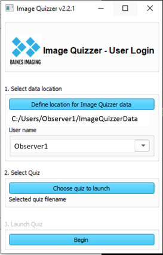

---
hide:
- toc
---
# Response capture

The quiz question responses are captured in a results xml file found in the Users/*Username*/ folder. If any annotations were created
(contours and/or markup measurement lines) these are found in subfolders, one for each Page.

## Location

When the user first logs in to the Image Quizzer, a results XML file is created with the same
name as the original master XML file. This file is placed in the Users/Username folder that gets created on the first login. 
You will find the Users folder under the directory you defined to be the database directory.

For example, *Observer1* has logged in to run the *ObserverContouringStudy* quiz.
The administrator has placed all the image volumes for this study in the folder named *ImageQuizzerData* (the database directory).
When the user logs in to the quiz session, he/she has to browse to the *ImageQuizzerData* database folder.



The results XML file will be found here:

```
.
└─ImageQuizzerData/
   ├─ImageVolumes/
   ├─SlicerDicomDatabse/
   └─Users/
     └─Observer1/
       └─ObserverContouringStudy.xml
```
	
This is a copy of the original master quiz as set up by the administrator.
As the quiz progresses throughout the user's login session, elements and attributes
are added to capture various pieces of information (responses, login times, username etc.)
as described below.

Each time the user exits and resumes the quiz, this results file is copied and renamed with a timestamp suffix
in order to safeguard against hardware issues or power failures.
The file without a timestamp suffix will be the most recent and most complete results file.

!!! note
    The SlicerDicomDatabase folder is created automatically by Slicer 
	when the user logs in to manage information about DICOM data.
	
### Annotations subfolders

If contours and markup lines were required, they are stored in subfolders - one for each Page. 
The assigned PageGroup number (either by administrator or automatically by the Image Quizzer) is embedded in the folder name for cross-referencing with the results quiz file.
For example, if there were 3 pages in the quiz and a contour and at least one markup line was requested for each,
the Users folder could look like this:

```
.
└─ImageQuizzerData/
   ├─ImageVolumes/
   ├─SlicerDicomDatabse/
   └─Users/
     └─Observer1/
       ├─ObserverContouringStudy.xml
	   ├─(PgGroup1_PageID_PageDescriptor)/
	   ├    ├─imagename-bainesquizlabel.nrrd
	   ├    ├─imagename_MarkupsLine_bainesquizline.nrrd
	   ├    └─imagename_MarkupsLine_1_bainesquizline.mrk
	   ├─(PgGroup2_PageID_PageDescriptor)/
	   ├    ├─imagename-bainesquizlabel.nrrd
	   ├    ├─imagename_MarkupsLine_bainesquizline.mrk
	   ├    ├─imagename_MarkupsLine_1_bainesquizline.mrk
	   ├    └─imagename_MarkupsLine_2_bainesquizline.mrk
	   └─(PgGroup3_PageID_PageDescriptor)/
	        ├─imagename-bainesquizlabel.nrrd
	        └─imagename_MarkupsLine_bainesquizline.mrk
	   
```
#### Contour capture

Creating a contour will add a LabelMapPath element as a child of the Image element to the results file
which stores the relative directory path where you can find the label map mask file.

It is stored in a subfolder with PgGroup#_PgID_PgDescriptor .

File name is constructed using ImageID_ImageDescriptor-bainesquizlabel.nrrd

#### MarkupLine capture

Creating [measurement lines](../user/extratrools.md#line-measurement) using the tool in the Extra Tools tab will create a MarkupLinePath element
as a child of the Image element to the results file. This element stores the relative directory path where you
can find the markup line file.

It is stored in a subfolder with PgGroup#_PgID_PgDescriptor .
File name is constructed using ImageID_ImageDescriptor-MarkupsLine_bainesquizline.mrk.json


## New Elements

### Response

The Response element is created as a child of each Option element.
The type of response captured depends on the [Question Type](elements_attributes/questionset/question/type.md) attribute. 

If the Type is an InfoBox, the response captured for the Option is null.
For  Radio or CheckBox types, the response is a "Y" or "N" value depending on whether the radio button or checkbox has been selected.
If the Type is a Text, IntegerValue, or FloatValue Types the response element will hold the text that the user input into that box.

Also captured as attributes in the Response element are timestamps LoginTime and the ResponseTime.

```
Examples for Response element based on Question Type:

InfoBox:
	<Question Descriptor="Introduction" Type="InfoBox">
		<Option>
			Using the Segment Editor tab, create a contour for displayed image
			<Response LoginTime="20230317_15:56:40.964017" ResponseTime="20230317_15:58:27.114871"/>
		</Option>
	</Question>
	
Radio
	<Question Descriptor="Assessment" Type="Radio">
		<Option>
			Injury
			<Response LoginTime="20230317_15:56:40.964017" ResponseTime="20230317_16:00:22.706985">Y</Response>
		</Option>
		<Option>
			Recurrence
			<Response LoginTime="20230317_15:56:40.964017" ResponseTime="20230317_16:00:22.706985">N</Response>
		</Option>
	</Question>

CheckBox
	<Question Descriptor="High Risk Features:" Type="CheckBox">
		<Option>
			Enlarging opacity
			<Response LoginTime="20230317_15:56:40.964017" ResponseTime="20230317_15:57:08.896963">Y</Response>
		</Option>
		<Option>
			Bulging margin
			<Response LoginTime="20230317_15:56:40.964017" ResponseTime="20230317_15:57:08.896963">Y</Response>
		</Option>
		<Option>
			Sequential enlargement
			<Response LoginTime="20230317_15:56:40.964017" ResponseTime="20230317_15:57:08.896963">N</Response>
		</Option>
	</Question>
    

```

### LabelMapPath

The LabelMapPath element is added as a child of the Image element to hold the relative path to the label map file if a contour was created on the image.

### MarkupLinePath

The MarkupLinePath element is added as a child of the Image element to hold the relative path to the 
markup line file(s) if any [line measurements](../user/extratrools.md#line-measurement) was created on the image.

### Login

When the user first logs in, a <Login\> element is added to the response XML file.
It holds the login and logout times for the user's session. 

```
<Login LoginTime="20221129_16:35:07.894893" LogoutTime="20221129_17:37:36.548557"/>
``` 

When the user completes the assigned quiz, a *QuizComplete="y"* attribute is added to this element.

```
<Login LoginTime="20221129_16:35:07.894893" LogoutTime="20221129_17:37:36.548557" QuizComplete="Y"/>
``` 

###  RandomizedPageGroupIndices

The <RandomizedPageGroupIndices\> element is added to the response XML file under the <Session\> element
if the RandomizePageGroups attribute was set to "Y" in the Session element. The
element holds the list of integers reflecting the randomized order of Page Groups used to direct the order of display of the quiz pages.
If this element is not present, then randomizing of pages was not done and the Image Quizzer
presented each page in the order defined in the original master quiz XML file.

An example of this element for 4 different page group numbers could look like this:

```
		<RandomizedPageGroupIndices>0,4,2,3,1</RandomizedPageGroupIndices>
```

PageGroup="0" always appears first if it exists.


## New Attributes

### UserName

Once a user has logged in to the Image Quizzer, the attribute _UserName_ will be added 
to the Session element
capturing the Windows defined user name. This allows you to keep track of who the XML
results quiz file belongs to, as long as each user has his/her own login profile.

```
<Session UserName="Observer1">
	<Page>
		...
	</Page>
</Session>
```

### PageGroup

[PageGroup](elements_attributes\page\pagegroup.md) numbers can be assigned by the administrator when setting up for randomizing the Pages of the observer study.
If they were not set up in the original XML master quiz file, the Image Quizzer will add this attribute to the Page element and assign a sequential number
starting at '1'. (A '0' has special meaning for the randomizing functionality).

### Rep

The Rep attribute is added to the Page element if any Page in the master XML quiz file has the attribute [Loop](elements_attributes/page/loop.md) set to "Y".
This reflects the repetition number for looping a page. If there was no looping the Rep attribute will be "0" (i.e. the original Page).

See also the [looping example](../administrator/examples/example_looping.md) for more details.

### PageComplete

The PageComplete attribute is added to the Page element once all the quiz questions and required annotations have been completed by the observer.
