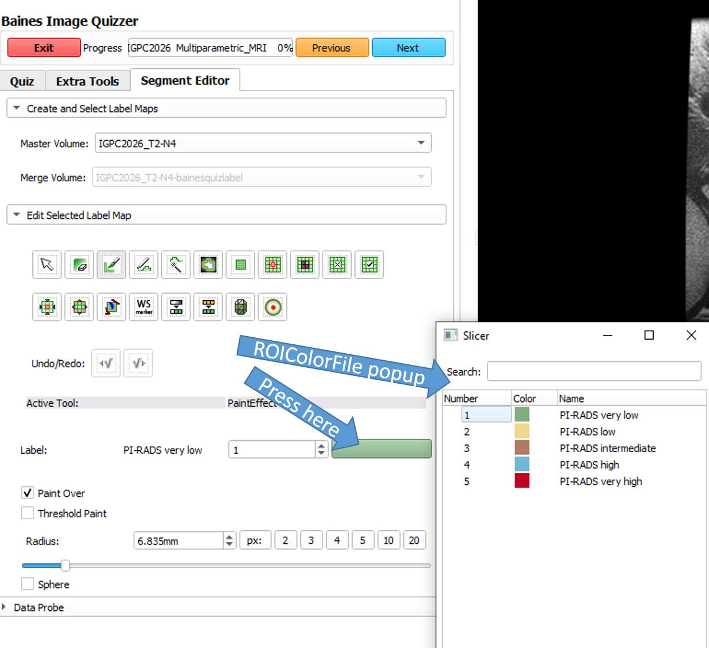

## Overview

The administrator has the ability to assign specific roi names and colors that will appear as options
when the user is in the segmentation editor. This can be useful when you want to restrict the user to
a specific set of ROI's and have each ROI categorized by color.

To activate this feature, the administrator must create a .txt file in an editor using the syntax shown below.
This file must be saved in the same folder as the study xml file.


Syntax for each line in the text file:

```
roi# roi_name red green blue alpha
```

## Example
### Setup

A color file is assigned to a study for PI-Rads segmentation:

```
Directory tree layout:
	|
	|-ObserverStudies
		|-PIRADS_SegmentationStudy.xml
		|-PiRadsStudy.txt
```


```
<Session ROIColorFile="PiRadsStudy">
	<Page>
		...
	</Page>
</Session>
```

```
PiRadsStudy.txt

1 PI-RADS_very_low 128 174 128 255
2 PI-RADS_low 241 214 145 255
3 PI-RADS_intermediate 177 122 101 255
4 PI-RADS_high 111 184 210 255
5 PI-RADS_very_high 191 2 34 255

```
###Usage

To activate the color file popup in the Segment Editor, the user must press on the label's color bar.



