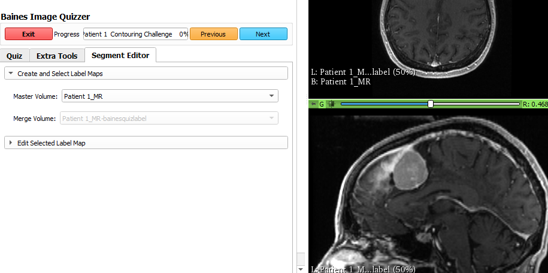
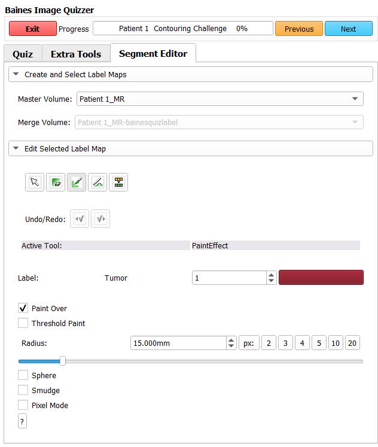

---
hide:
- toc
---
<!-- let javascript handle toc on left sidebar -->
# Contouring

The user can create a contour on images that have the Segment Editor enabled.

## Segment Editor tab

1. Select the 'Master Volume' that the contour is to be associated with. 

    

    Once the master volume is selected a label map volume is created with the same master name and a suffix '-quizlabel' to hold the contours created.

1. Open the collapsible section labelled 'Edit Selected Label Map'

    

    Select the tool to use to draw the contour.

    - Paint
    - Draw

    Select the color for the contour. By clicking on the color box under 'Active Tool' section,
    a popup window will show the available colors.
	
    You can adjust the radius of the paint brush if using the PaintEffect tool.

    To erase an area, select the erase button or color 0 and then select the 'erase' drawing tool.
    You can also use the undo/redo buttons.

The following table describes functionalities of the editing tool:

| Tool name | Functionality | Notes |
|---|---|---|
| DefaultTool | end the contouring and return to the default cursor | |
| EraseLabel| to remove portions of the contour | first press 'Erase' then press either 'Paint' or 'Draw' tools |
| PaintEffect | to paint a contour with a 'brush' | |
| DrawEffect | to draw a contour with a 'pen' | |
| ChangeLabelEffect | to change a previously drawn contour's index#/color | select Input as the color to change and Output as the color to change to |
| Undo/Redo | remove or restore previous contour | |
| Sphere | to create a 3D contour that spans multiple slices ||
| Smudge | automatically toggle between erase and draw  | starting inside a contour toggles to draw; starting outside contour toggles to erase |

