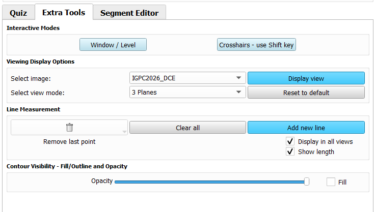

---
hide:
- toc
---
<!-- let javascript handle toc on left sidebar -->
# Extra Tools

The Image Quizzer has an **Extra Tools** tab that provides the user with
quick access to a number of tools for image analysis.

## Window/Level

Click the **On** button for quick access to Slicer's window/level tool.
Use **Default Cursor** to exit the window/level functionality and return to the default cursor mode.

## Crosshairs

Use the **On/Off** buttons to toggle Slicer's crosshairs tool.
When Crosshairs are turned on, hold the **Shift** key as you move the mouse over the images.

Use the **Slice Intersections** checkbox to display crosshairs in each of the image views
that are interactive as you scroll through the image slices.

## Viewing display options

For any of the loaded images you can change the viewing windows display layout.

First select the image for which you want to change the display layout.
Then select the viewing mode: 1 plane only (axial, coronal, or sagittal) or 3 planes to display all orientations.
Then click the **Display view** button to activate.
Use **Reset to default** to return to the display layout as defined by the quiz.

## Line measurement

Use the **Add new line** button to activate Slicer's ruler tool.
Create the line using mouse clicks at the beginning and end of the feature on the image you wish to measure.

Once you click on the 2nd point, a measurement will be displayed on the image viewing window.

You have the option to remove the last created point(s) by clicking the trash can button
or to remove all points by clicking the **Clear all** button.

## Contour visibility

### Fill/outline and opacity

When a contour has been created using the **Segment Editor** tool,
you have the option to change the contour display from a solid filled in feature to an outline by toggling the **Fill** checkbox.
You can also change the opacity of the contour using the slider bar.

The visibility state chosen (fill or outline) will persist until the next page of images and questions appear.
Then the display will return to the quiz default.