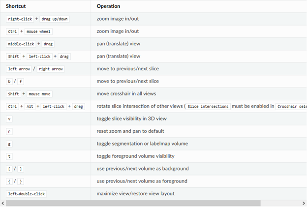
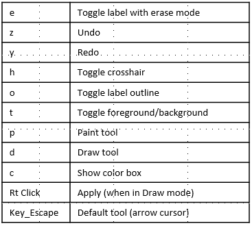

---
hide:
- toc
---
<!-- let javascript handle toc on left sidebar -->
# Keyboard shortcuts

## Navigating shortcuts

Following are 3D Slicer keyboard shortcuts that may be useful as you navigate the images displayed
by the Image Quizzer. 

Refer to [3D Slicer keyboard shortcuts](https://slicer.readthedocs.io/en/latest/user_guide/user_interface.html#mouse-keyboard-shortcuts)

## Contouring editor shortcuts

When in the contouring segment editor, the followng 3D Slicer shortcuts are available.

Refer to [3D Slicer Segment editor shortcuts](https://slicer.readthedocs.io/en/latest/user_guide/modules/segmenteditor.html#keyboard-shortcuts)
