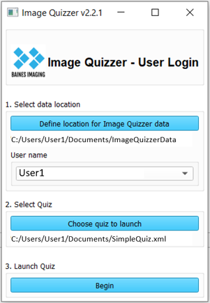

---
hide:
- toc
---
<!-- let javascript handle toc on left sidebar -->
# Using Image Quizzer

## Start Image Quizzer

Refer to [Getting started > How to start the Image Quizzer](../getting_started/index.md#how-to-start-the-image-quizzer)

Once the Image Quizzer is started, you start your session by logging in.

## Login

Following are the steps to launch the quiz.

1. Define location for Image Quizzer data.

    Navigate to the directory given to you by the quiz administrator. 
	This is the parent directory holding the images for the quiz.
	The default location is .../ImageQuizzerProject/ImageQuizzer/Inputs/Images/ImageDatabase. 

1. User Name

	The login screen will display the Windows login user name as a default.
	The user has the option to change this. (This is convenient for a user
	working off a USB stick which is being plugged into multiple PC's with
	different login user names.)

1. Select Quiz

    Browse to the XML quiz file as given to you by the quiz administrator.
    This is the script that defines which images and questions are to be displayed
	while you navigate through the quiz.
	
1. Launch Quiz

    Press the Begin button to launch the quiz session.
    This button will not be enabled until you have selected the data directory and the quiz to be launched.

## Navigating the quiz

Once the quiz has been launched, the images will be displayed as well as any
instructions or quiz questions. The set of images and questions is also known as a 'Page'.

Use the **Next** and **Previous** buttons to move
to the next/previous pages (sets of images and questions). 

Choosing **Next** will activate a quiz validation function to make sure all required
questions, contours and annotations are complete before the next page is presented.

If you choose **Previous** and the quiz questions displayed are greyed out, that
means you are only allowed to view your previous responses. You cannot
change them.

## Exit and resume

There is a progress bar at the top of the quiz display to show how far along you are in the quiz.
You can exit the quiz at any time by pressing the **Exit** button. All partial and complete responses, contours, and annotations
entered for that page will be captured and saved to disk.

You can then log back in to the Image Quizzer when it is convenient to resume the quiz.
If you had completed all required elements of a page, the next page will automatically be shown.
If there was only partial completion, the same page will be displayed at the time when you pressed **Exit**.

## Quiz complete

Once you have completed all pages in the quiz, all responses, contours and annotations are saved to disk and the quiz will exit.
You can log back in to review your responses, but you won't be able to edit them.
